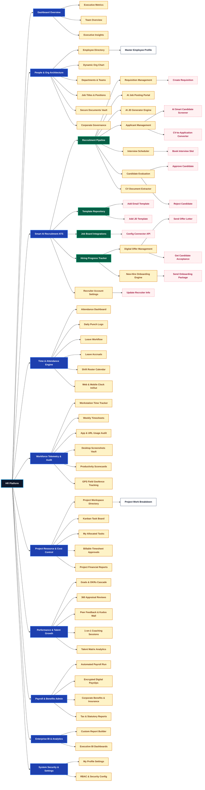

```mermaid
flowchart LR

    HR["HR Platform"]

    %% =========================
    %% Dashboard
    %% =========================
    HR --> Dashboard["Dashboard Overview"]

    Dashboard --> DashSummary["Executive Metrics"]
    Dashboard --> TeamAnalytics["Team Overview"]
    Dashboard --> BIInsights["Executive Insights"]

    %% =========================
    %% People & Organization
    %% =========================
    HR --> People["People & Org Architecture"]

    People --> StaffDirectory["Employee Directory"]
    StaffDirectory --> StaffProfile["Master Employee Profile"]

    People --> OrgChart["Dynamic Org Chart"]
    People --> Depts["Departments & Teams"]
    People --> Roles["Job Titles & Positions"]
    People --> VaultDocs["Secure Documents Vault"]
    People --> Governance["Corporate Governance"]

    %% =========================
    %% Smart AI Recruitment
    %% =========================
    HR --> Recruitment["Smart AI Recruitment ATS"]

    Recruitment --> RecruitMgmt["Recruitment Pipeline"]

    RecruitMgmt --> Requisitions["Requisition Management"]
    Requisitions --> AddRequisitionModal["Create Requisition"]

    RecruitMgmt --> AIPublicJob["AI Job Posting Portal"]

    RecruitMgmt --> AIGenerateJD["AI JD Generator Engine"]

    RecruitMgmt --> ApplicantHub["Applicant Management"]
    ApplicantHub --> AIAutoFilter["AI Smart Candidate Screener"]
    ApplicantHub --> TransformCV["CV-to-Application Converter"]

    RecruitMgmt --> InterviewSchedule["Interview Scheduler"]
    InterviewSchedule --> AddInterviewSlot["Book Interview Slot"]

    RecruitMgmt --> InterviewAudit["Candidate Evaluation"]
    InterviewAudit --> ApproveCandidate["Approve Candidate"]
    InterviewAudit --> DeclineCandidate["Reject Candidate"]

    RecruitMgmt --> ProcessCV["CV Document Extractor"]

    Recruitment --> TemplateRepo["Template Repository"]
    TemplateRepo --> EmailTemplate["Add Email Template"]
    TemplateRepo --> JDTemplate["Add JD Template"]

    Recruitment --> Integrations["Job Board Integrations"]
    Integrations --> ConfigAPI["Config Connector API"]

    Recruitment --> HiringProgress["Hiring Progress Tracker"]

    HiringProgress --> OfferAdmin["Digital Offer Management"]
    OfferAdmin --> DispatchOffer["Send Offer Letter"]
    OfferAdmin --> OfferAcceptance["Get Candidate Acceptance"]

    HiringProgress --> OnboardingHub["New-Hire Onboarding Engine"]
    OnboardingHub --> SendOnboard["Send Onboarding Package"]

    Recruitment --> RecruiterAccount["Recruiter Account Settings"]
    RecruiterAccount --> UpdateRecruiterProfile["Update Recruiter Info"]

    %% =========================
    %% Time & Attendance
    %% =========================
    HR --> Time["Time & Attendance Engine"]

    Time --> AttendanceDash["Attendance Dashboard"]
    Time --> AttendanceLog["Daily Punch Logs"]
    Time --> LeaveRequests["Leave Workflow"]
    Time --> LeaveBalance["Leave Accruals"]
    Time --> ShiftSchedule["Shift Roster Calendar"]
    Time --> ClockInOut["Web & Mobile Clock In/Out"]

    %% =========================
    %% Tracking & Audit
    %% =========================
    HR --> Tracking["Workforce Telemetry & Audit"]

    Tracking --> TimeTracking["Workstation Time Tracker"]
    Tracking --> Timesheets["Weekly Timesheets"]
    Tracking --> ActivityMonitoring["App & URL Usage Audit"]
    Tracking --> Screenshots["Desktop Screenshots Vault"]
    Tracking --> ProductivityReport["Productivity Scorecards"]
    Tracking --> GPSTracking["GPS Field Geofence Tracking"]

    %% =========================
    %% Projects & Cost Control
    %% =========================
    HR --> Projects["Project Resource & Cost Control"]

    Projects --> ProjectList["Project Workspace Directory"]
    ProjectList --> ProjectDetails["Project Work Breakdown"]

    Projects --> TaskBoard["Kanban Task Board"]
    Projects --> MyTasks["My Allocated Tasks"]
    Projects --> TimesheetApproval["Billable Timesheet Approvals"]
    Projects --> ProjectReports["Project Financial Reports"]

    %% =========================
    %% Performance & Talent
    %% =========================
    HR --> Performance["Performance & Talent Growth"]

    Performance --> Goals["Goals & OKRs Cascade"]
    Performance --> PerformanceReviews["360 Appraisal Reviews"]
    Performance --> GiveFeedback["Peer Feedback & Kudos Wall"]
    Performance --> OneOnOne["1-on-1 Coaching Sessions"]
    Performance --> PerformanceInsights["Talent Matrix Analytics"]

    %% =========================
    %% Payroll & Benefits
    %% =========================
    HR --> Payroll["Payroll & Benefits Admin"]

    Payroll --> PayrollRun["Automated Payroll Run"]
    Payroll --> Payslips["Encrypted Digital Payslips"]
    Payroll --> Benefits["Corporate Benefits & Insurance"]
    Payroll --> PayrollReports["Tax & Statutory Reports"]

    %% =========================
    %% Reports & Analytics
    %% =========================
    HR --> Reports["Enterprise BI & Analytics"]

    Reports --> ReportsCenter["Custom Report Builder"]
    Reports --> AnalyticsDashboard["Executive BI Dashboards"]

    %% =========================
    %% Account & Settings
    %% =========================
    HR --> Account["System Security & Settings"]

    Account --> MyProfile["My Profile Settings"]
    Account --> SecuritySettings["RBAC & Security Config"]

    %% =========================
    %% STYLES
    %% =========================
    classDef root fill:#0F172A,color:#FFFFFF,stroke:#0284C7,stroke-width:3px,font-weight:bold;

    classDef module fill:#1E40AF,color:#FFFFFF,stroke:#3B82F6,stroke-width:2px,font-weight:bold;

    classDef mainScreen fill:#065F46,color:#FFFFFF,stroke:#10B981,stroke-width:2px,font-weight:bold;

    classDef subScreen fill:#FEF3C7,color:#78350F,stroke:#D97706,stroke-width:1.5px,font-weight:bold;

    classDef popup fill:#FFF1F2,color:#9F1239,stroke:#F43F5E,stroke-width:1px,stroke-dasharray:4 3;

    classDef detail fill:#FFFFFF,color:#0F172A,stroke:#64748B,stroke-width:1.5px;

    class HR root;

    class Dashboard,People,Recruitment,Time,Tracking,Projects,Performance,Payroll,Reports,Account module;

    %% Dashboard
    class DashSummary,TeamAnalytics,BIInsights subScreen;

    %% People
    class StaffDirectory,OrgChart,Depts,Roles,VaultDocs,Governance subScreen;
    class StaffProfile detail;

    %% Recruitment Main Screens
    class RecruitMgmt,TemplateRepo,Integrations,HiringProgress mainScreen;

    %% Recruitment Sub Screens
    class Requisitions,AIPublicJob,AIGenerateJD,ApplicantHub,InterviewSchedule,InterviewAudit,ProcessCV subScreen;

    class OfferAdmin,OnboardingHub,RecruiterAccount subScreen;

    %% Recruitment Popups
    class AddRequisitionModal,AIAutoFilter,TransformCV,AddInterviewSlot,ApproveCandidate,DeclineCandidate popup;

    class EmailTemplate,JDTemplate,ConfigAPI popup;

    class DispatchOffer,OfferAcceptance,SendOnboard,UpdateRecruiterProfile popup;

    %% Time & Attendance
    class AttendanceDash,AttendanceLog,LeaveRequests,LeaveBalance,ShiftSchedule,ClockInOut subScreen;

    %% Tracking
    class TimeTracking,Timesheets,ActivityMonitoring,Screenshots,ProductivityReport,GPSTracking subScreen;

    %% Projects
    class ProjectList,TaskBoard,MyTasks,TimesheetApproval,ProjectReports subScreen;
    class ProjectDetails detail;

    %% Performance
    class Goals,PerformanceReviews,GiveFeedback,OneOnOne,PerformanceInsights subScreen;

    %% Payroll
    class PayrollRun,Payslips,Benefits,PayrollReports subScreen;

    %% Reports
    class ReportsCenter,AnalyticsDashboard subScreen;

    %% Account
    class MyProfile,SecuritySettings subScreen;
```
