## HR Platform Feature Mindmap

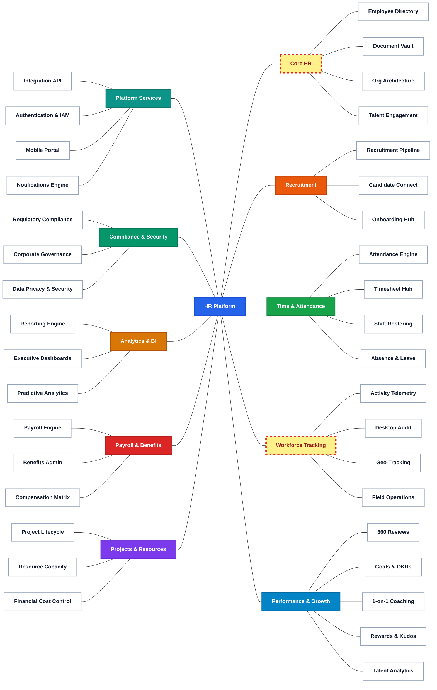
```mermaid
flowchart LR

    %% =========================
    %% CENTER MODULE
    %% =========================
    HR["HR Platform"]

    %% =========================
    %% LEFT MAIN MODULES
    %% =========================
    PLATFORM["Platform Services"]
    COMPLIANCE["Compliance & Security"]
    ANALYTICS["Analytics & BI"]
    PAYROLL["Payroll & Benefits"]
    PROJECTS["Projects & Resources"]

    PLATFORM --- HR
    COMPLIANCE --- HR
    ANALYTICS --- HR
    PAYROLL --- HR
    PROJECTS --- HR

    %% Platform features
    Integration["Integration API"] --- PLATFORM
    Authentication["Authentication & IAM"] --- PLATFORM
    Mobile["Mobile Portal"] --- PLATFORM
    Notifications["Notifications Engine"] --- PLATFORM

    %% Compliance features
    ComplianceFeature["Regulatory Compliance"] --- COMPLIANCE
    Governance["Corporate Governance"] --- COMPLIANCE
    Security["Data Privacy & Security"] --- COMPLIANCE

    %% Analytics features
    Reporting["Reporting Engine"] --- ANALYTICS
    Dashboards["Executive Dashboards"] --- ANALYTICS
    AnalyticsFeature["Predictive Analytics"] --- ANALYTICS

    %% Payroll features
    PayrollFeature["Payroll Engine"] --- PAYROLL
    Benefits["Benefits Admin"] --- PAYROLL
    Compensation["Compensation Matrix"] --- PAYROLL

    %% Projects features
    ProjectManagement["Project Lifecycle"] --- PROJECTS
    ResourceManagement["Resource Capacity"] --- PROJECTS
    FinancialControl["Financial Cost Control"] --- PROJECTS

    %% =========================
    %% RIGHT MAIN MODULES
    %% =========================
    CORE["Core HR"]
    RECRUITMENT["Recruitment"]
    TIME["Time & Attendance"]
    TRACKING["Workforce Tracking"]
    PERFORMANCE["Performance & Growth"]

    HR --- CORE
    HR --- RECRUITMENT
    HR --- TIME
    HR --- TRACKING
    HR --- PERFORMANCE

    %% Core HR features (HIGHLIGHTED CORE MODULE)
    CORE --- Employee["Employee Directory"]
    CORE --- Documents["Document Vault"]
    CORE --- Organization["Org Architecture"]
    CORE --- EmployeeExperience["Talent Engagement"]

    %% Recruitment features
    RECRUITMENT --- Hiring["Recruitment Pipeline"]
    RECRUITMENT --- Communication["Candidate Connect"]
    RECRUITMENT --- Onboarding["Onboarding Hub"]

    %% Time features
    TIME --- Attendance["Attendance Engine"]
    TIME --- TimeManagement["Timesheet Hub"]
    TIME --- Scheduling["Shift Rostering"]
    TIME --- Leave["Absence & Leave"]

    %% Workforce Tracking features (HIGHLIGHTED CORE MODULE)
    TRACKING --- ActivityMonitoring["Activity Telemetry"]
    TRACKING --- ComputerMonitoring["Desktop Audit"]
    TRACKING --- LocationTracking["Geo-Tracking"]
    TRACKING --- FieldOperations["Field Operations"]

    %% Performance features
    PERFORMANCE --- Reviews["360 Reviews"]
    PERFORMANCE --- Goals["Goals & OKRs"]
    PERFORMANCE --- Coaching["1-on-1 Coaching"]
    PERFORMANCE --- Recognition["Rewards & Kudos"]
    PERFORMANCE --- Insights["Talent Analytics"]

    %% =========================
    %% STYLES & VIBRANT PALETTE
    %% =========================
    classDef center fill:#2563eb,stroke:#1d4ed8,stroke-width:3px,color:#ffffff,font-weight:bold;
    
    %% Bold Vibrant Main Module Styles
    classDef platform fill:#0d9488,stroke:#0f766e,stroke-width:2px,color:#ffffff,font-weight:bold;
    classDef compliance fill:#059669,stroke:#047857,stroke-width:2px,color:#ffffff,font-weight:bold;
    classDef analytics fill:#d97706,stroke:#b45309,stroke-width:2px,color:#ffffff,font-weight:bold;
    classDef payroll fill:#dc2626,stroke:#b91c1c,stroke-width:2px,color:#ffffff,font-weight:bold;
    classDef projects fill:#7c3aed,stroke:#6d28d9,stroke-width:2px,color:#ffffff,font-weight:bold;

    classDef recruitment fill:#ea580c,stroke:#c2410c,stroke-width:2px,color:#ffffff,font-weight:bold;
    classDef time fill:#16a34a,stroke:#15803d,stroke-width:2px,color:#ffffff,font-weight:bold;
    classDef performance fill:#0284c7,stroke:#0369a1,stroke-width:2px,color:#ffffff,font-weight:bold;

    %% DISTINCT HIGHLIGHT STYLE FOR MODIFIED / KEY CORE MODULES (Yellow fill + dashed red border)
    classDef highlight fill:#fef08a,stroke:#dc2626,stroke-width:4px,color:#991b1b,font-weight:bold,stroke-dasharray: 6 6;

    %% Sub-feature Leaf Nodes
    classDef feature fill:#ffffff,stroke:#94a3b8,stroke-width:1.5px,color:#0f172a,font-weight:bold;

    class HR center;

    class PLATFORM platform;
    class COMPLIANCE compliance;
    class ANALYTICS analytics;
    class PAYROLL payroll;
    class PROJECTS projects;

    class CORE highlight;
    class RECRUITMENT recruitment;
    class TIME time;
    class TRACKING highlight;
    class PERFORMANCE performance;

    class Integration,Authentication,Mobile,Notifications feature;
    class ComplianceFeature,Governance,Security feature;
    class Reporting,Dashboards,AnalyticsFeature feature;
    class PayrollFeature,Benefits,Compensation feature;
    class ProjectManagement,ResourceManagement,FinancialControl feature;

    class Employee,Documents,Organization,EmployeeExperience feature;
    class Hiring,Communication,Onboarding feature;
    class Attendance,TimeManagement,Scheduling,Leave feature;
    class ActivityMonitoring,ComputerMonitoring,LocationTracking,FieldOperations feature;
    class Reviews,Goals,Coaching,Recognition,Insights feature;
```

---

## Actor Relationships Diagram

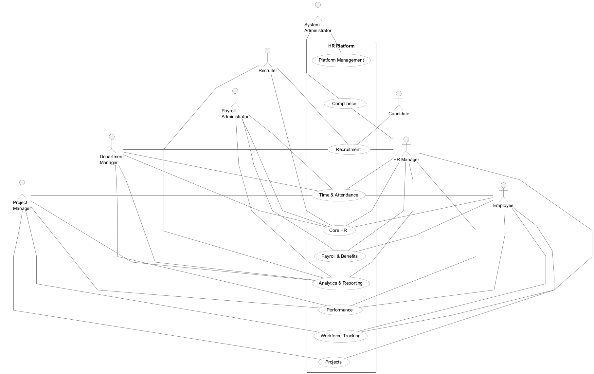

---

## 🏊 Layer 1 Core Business Process Swimlane Diagrams

### 1. End-to-End Recruitment, Hiring & Employee Onboarding Workflow
**Description:** Full lifecycle swimlane process covering Job Requisition Approval, Automated CV Screening, Interview Scorecards, Digital Offer Letters, and Account Onboarding.

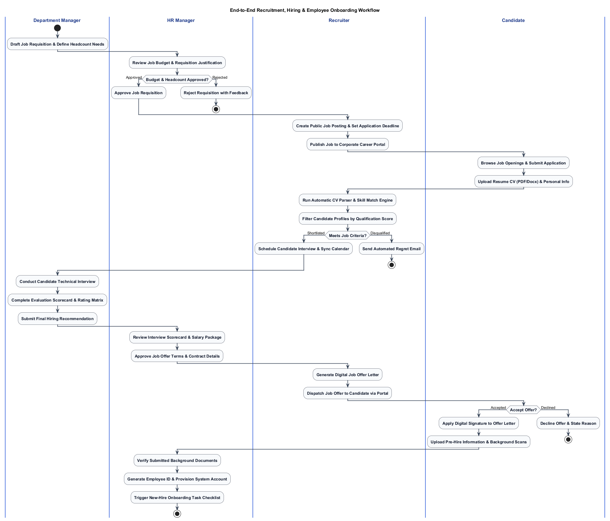

---

### 2. Time Attendance, Timesheet Approval & Monthly Payroll Disbursement Workflow
**Description:** Monthly operational swimlane workflow covering Daily Attendance Punching, Manager Timesheet Verification & Locking, Automated Payroll Calculation (Tax/BHXH), and Direct Bank Disbursement.

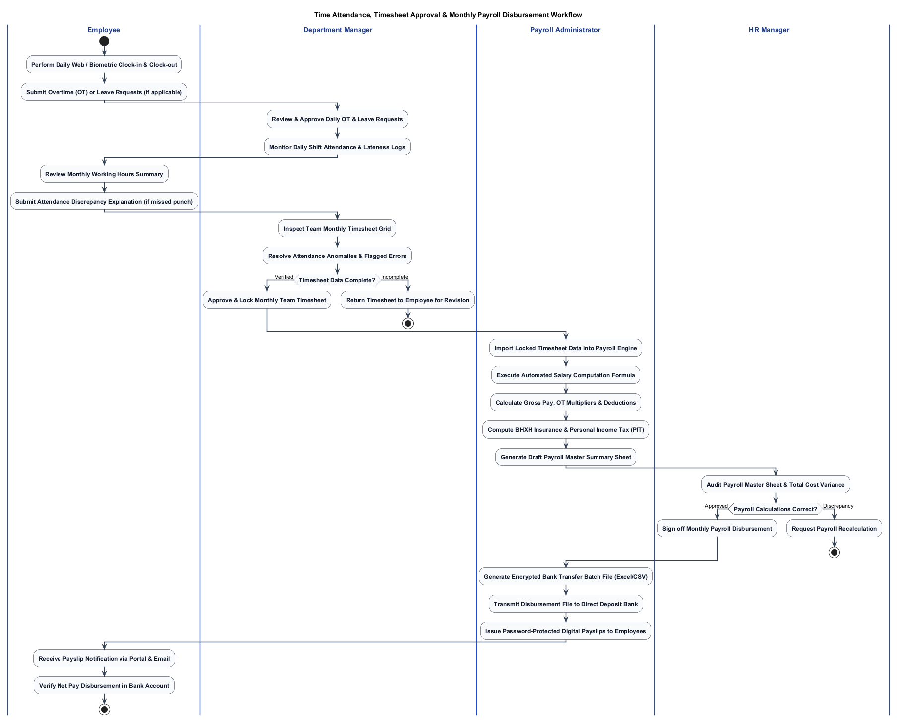

---

### 3. 360-Degree Performance Evaluation & Strategic Goals/OKR Calibration Workflow
**Description:** Strategic performance management workflow covering Company OKR Cascade, 360-Degree Feedback & Self-Appraisal, Manager 1-on-1 Coaching, Executive Calibration, and Bonus/Kudos Distribution.

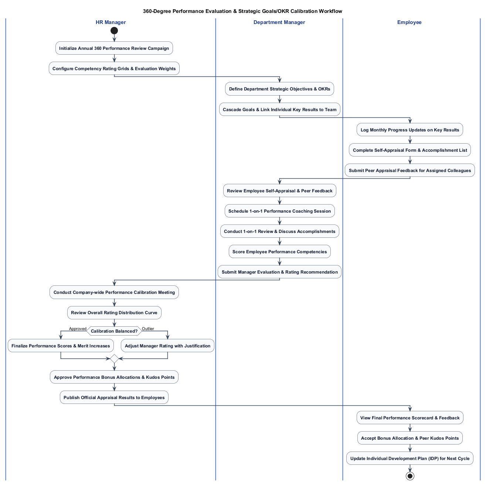

---

## 📋 60 Detailed Use Case Diagrams (UC01 - UC60)

# 🏢 Module: Core HR & Employee Management

### UC01: Manage Employee Profiles
**Description:** Create, update, and manage employee personal particulars, academic background, and emergency contact information.

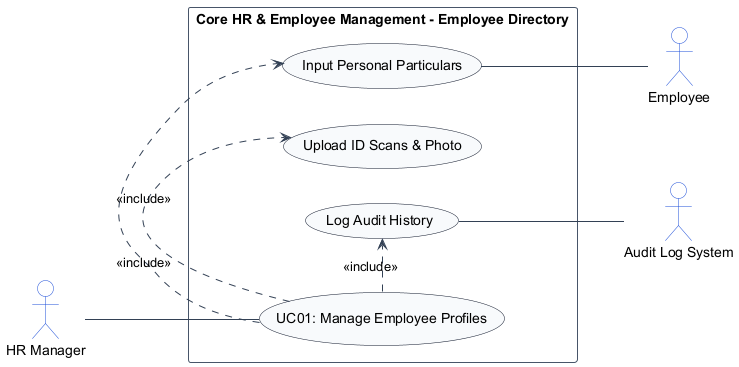

---

### UC02: Manage Org Hierarchy & Departments
**Description:** Configure company organization charts, department trees, branch locations, and managerial reporting lines.

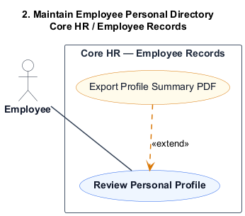

---

### UC03: Define Job Grades & Position Matrix
**Description:** Define standard job grade structures, standardized position codes, and job description (JD) dictionaries.

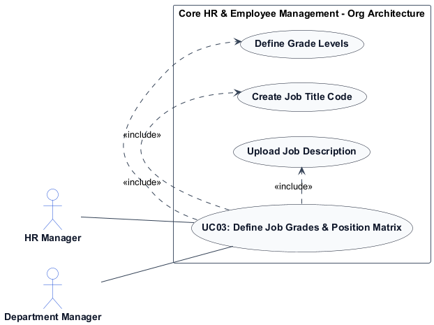

---

### UC04: Process Employee Transfers & Promotions
**Description:** Execute employee department transfers, job promotions, location changes, and title updates.

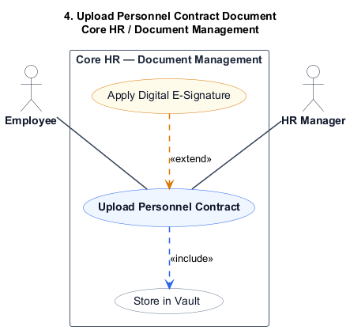

---

### UC05: Update Probation & Offboarding Status
**Description:** Transition employees from probation to official status, or process resignation and lock offboarded user accounts.

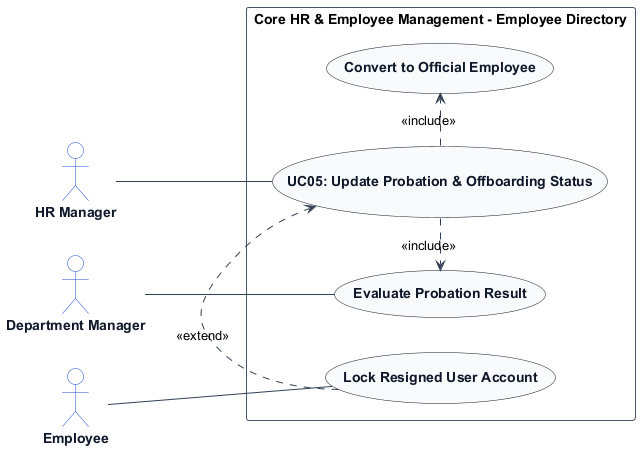

---

### UC06: Upload & Sign Employee E-Contracts
**Description:** Sign employment contracts digitally with legally binding e-signatures and archive them in the secure Document Vault.

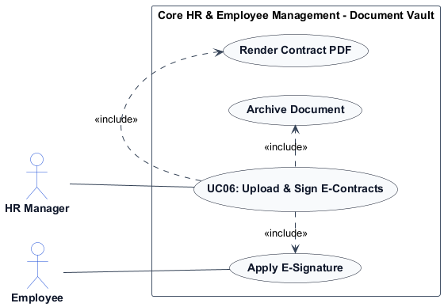

---

### UC07: Track Contract Expirations & Renewals
**Description:** Automatically track expiring employment contracts to trigger renewal workflows or termination notices.

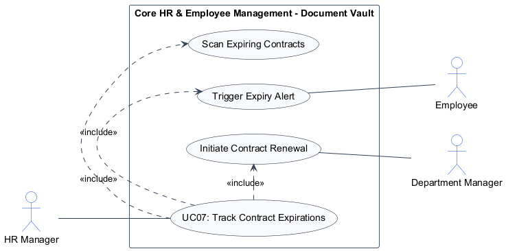

---

### UC08: Manage Academic Credentials & Skills
**Description:** Maintain records of academic degrees, professional certifications, and employee skill profiles.

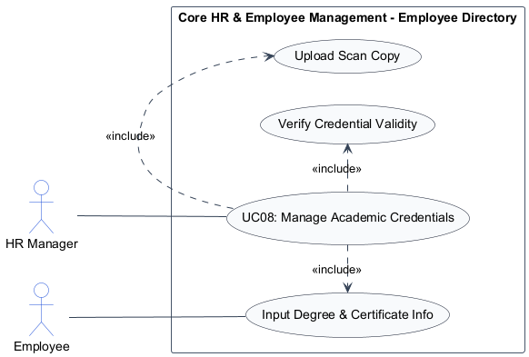

---

### UC09: Register Tax Dependents
**Description:** Register tax dependents (children, elderly parents) for personal income tax deduction compliance.

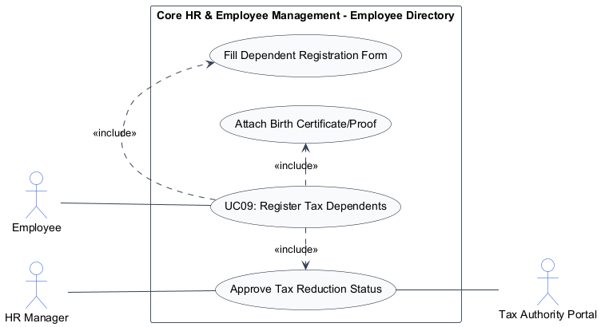

---

### UC10: Execute Onboarding Task Checklist
**Description:** Track and complete new-hire onboarding checklists including IT asset provisioning, email setup, and workspace allocation.

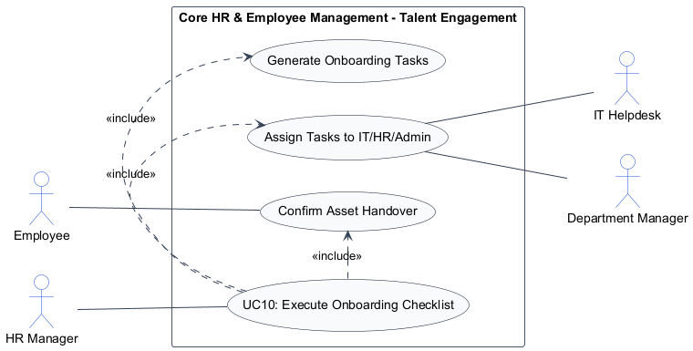

---

# 🏢 Module: Time & Attendance Management

### UC11: Record Web & Biometrics Attendance
**Description:** Capture daily employee clock-in and clock-out timestamps via web application or biometrics hardware.

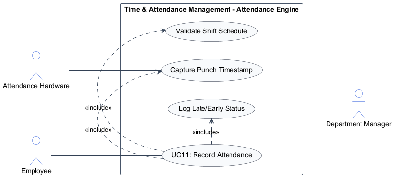

---

### UC12: Submit & Approve Overtime Requests
**Description:** Create overtime (OT) requests and route them to managers for approval and multiplier calculation.

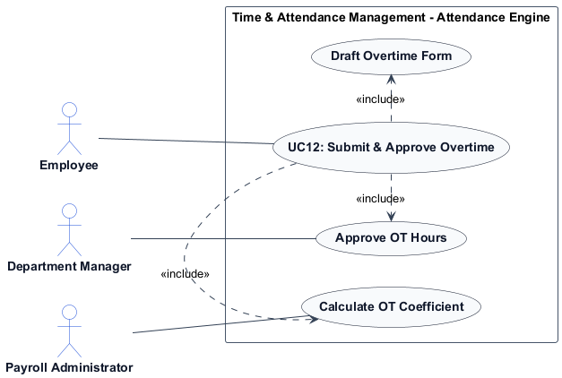

---

### UC13: Submit & Approve Leave Requests
**Description:** Submit annual leave, sick leave, maternity leave, or unpaid leave requests for manager approval.

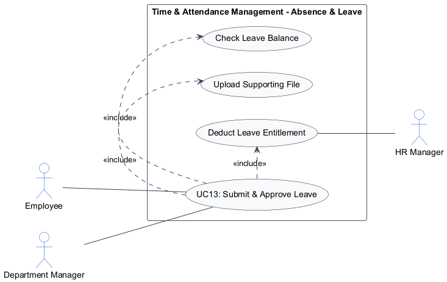

---

### UC14: Check Leave Balance & Absence History
**Description:** View real-time annual leave balances, accrued seniority leave days, and historical leave request records.

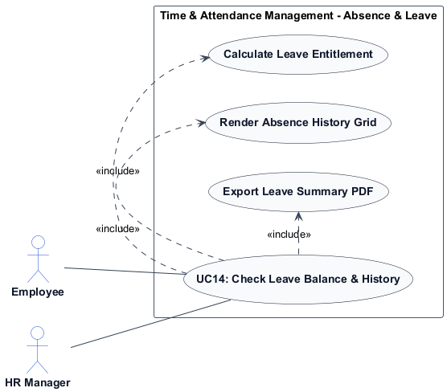

---

### UC15: Create Shift Schedules & Rosters
**Description:** Build and publish weekly or monthly shift rosters (morning, afternoon, night shifts) for team members.

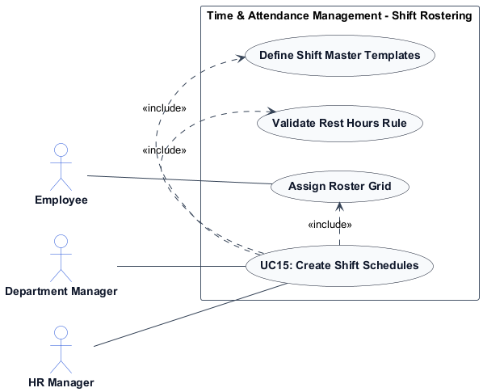

---

### UC16: Request Shift Swap & Replacement
**Description:** Initiate shift swap requests between peer employees for manager review and schedule updates.

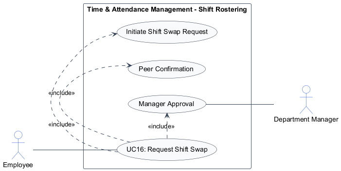

---

### UC17: Submit Attendance Discrepancy Explanation
**Description:** Submit attendance adjustment explanations for missed punches, hardware failures, or business trips.

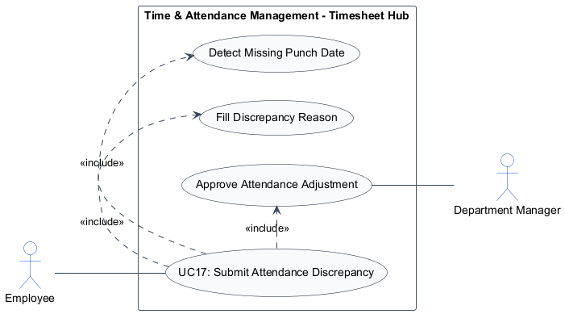

---

### UC18: Verify & Approve Team Timesheets
**Description:** Review, resolve anomalies, and lock monthly team timesheets before payroll processing.

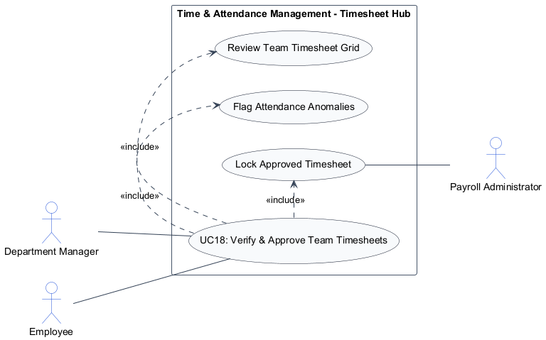

---

### UC19: Configure Public Holidays & Work Calendar
**Description:** Configure annual public holidays, paid leave days, and standard working day calendars.

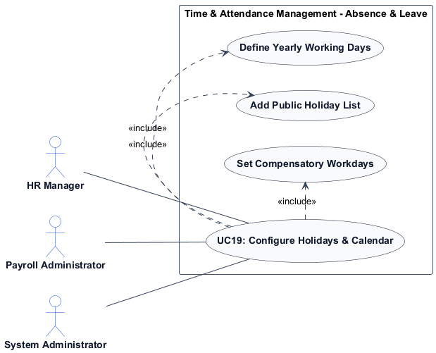

---

# 🏢 Module: Payroll & Compensation

### UC20: Calculate Monthly Payroll & Net Salary
**Description:** Execute the automated payroll engine to compute gross salary, net pay, tax withholdings, and statutory insurance.

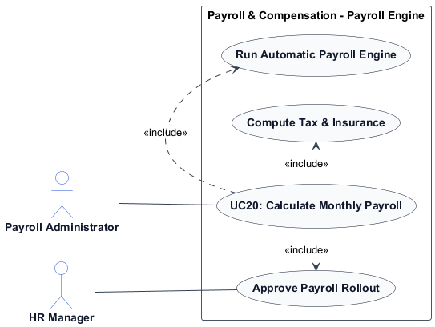

---

### UC21: Generate & Distribute Digital Payslips
**Description:** Automatically issue password-protected digital payslips to employees via web portal and email.

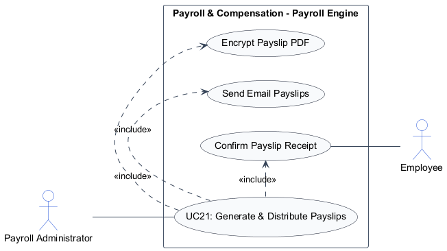

---

### UC22: Manage BHXH & Insurance Enrollments
**Description:** Manage social insurance (BHXH), health insurance enrollments, and statutory contribution reporting.

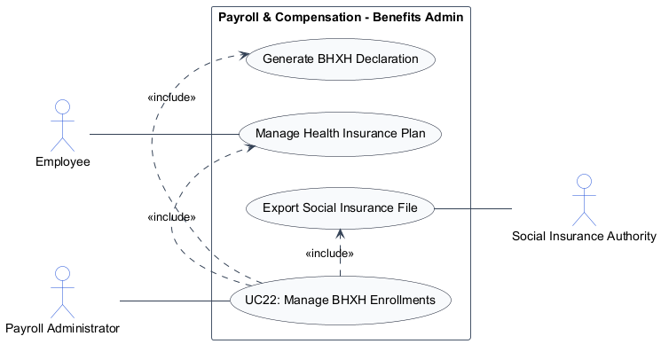

---

### UC23: Submit & Process Flex Benefit Claims
**Description:** Submit flexible benefit reimbursement claims (medical, education, wellness) with VAT invoice proof.

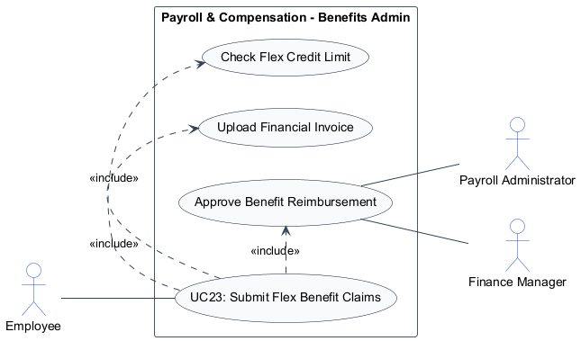

---

### UC24: Configure Tax Brackets & Insurance Rules
**Description:** Configure progressive personal income tax brackets, deduction thresholds, and insurance contribution rates.

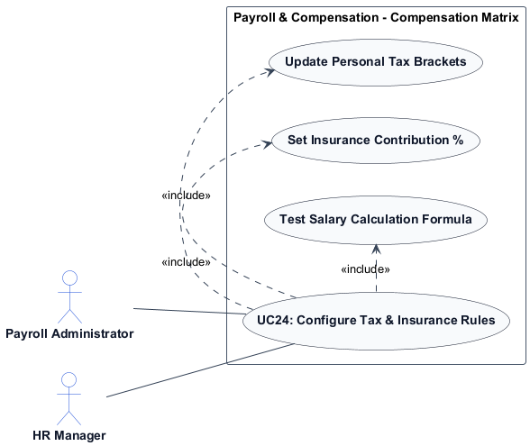

---

### UC25: Calculate Performance Bonuses & Commissions
**Description:** Compute performance bonuses, holiday bonuses, and tiered sales commissions based on KPI targets.

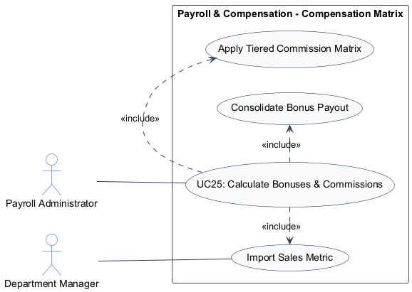

---

### UC26: Manage Allowances & Salary Deductions
**Description:** Configure recurring allowances (meal, transport, phone) and voluntary or statutory salary deductions.

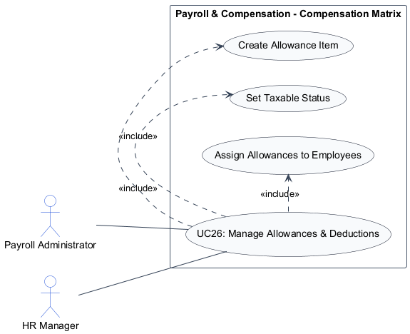

---

### UC27: Generate Bank Payroll Transfer File
**Description:** Export bank-format batch transfer files (Excel/CSV) for direct salary disbursement.

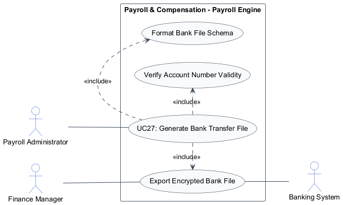

---

### UC28: Process Employee Payslip Discrepancy
**Description:** Handle employee salary inquiries or discrepancy tickets and process retroactive pay adjustments.

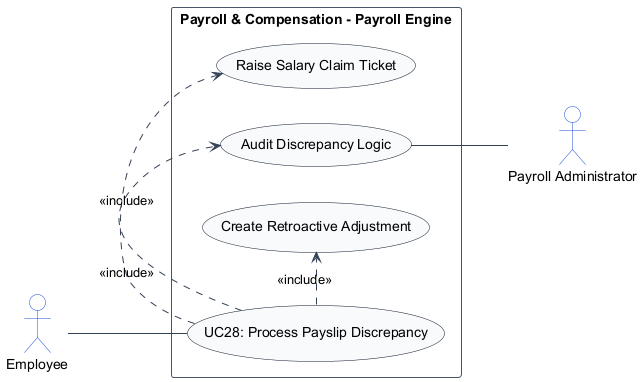

---

# 🏢 Module: Recruitment & Hiring

### UC29: Create & Approve Job Requisitions
**Description:** Create job requisitions for open positions and route them for budget approval from HR and Finance managers.

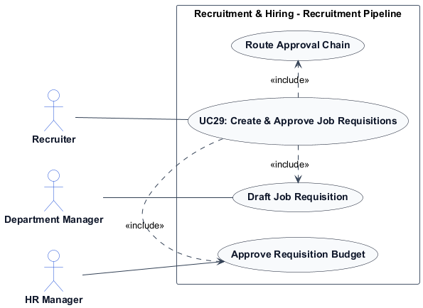

---

### UC30: Post Jobs to Career Portal
**Description:** Publish approved job postings to the company career portal with custom job descriptions and deadlines.

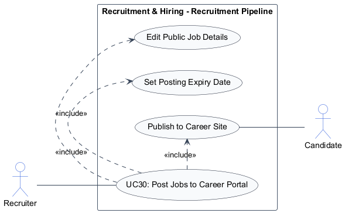

---

### UC31: Parse & Filter Candidate Applications
**Description:** Automatically parse candidate CVs (PDF/Docx) and match candidate skill profiles against job requirements.

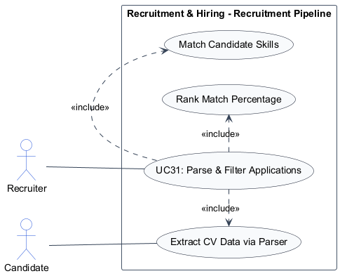

---

### UC32: Track Candidate Pipeline Stages
**Description:** Manage applicant progress across recruitment pipeline stages using an interactive Kanban board.

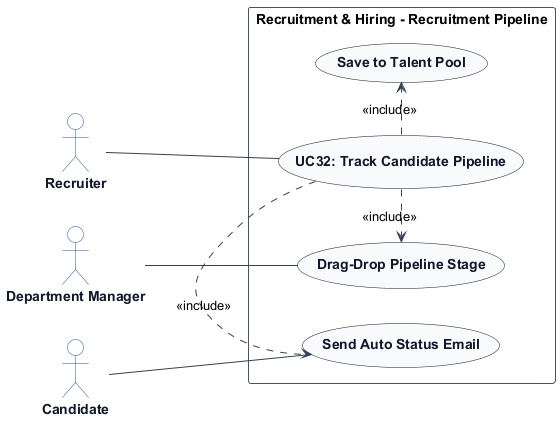

---

### UC33: Schedule Interviews & Sync Calendars
**Description:** Schedule candidate interviews, invite interview panels, and generate calendar sync links (Google Meet/Zoom).

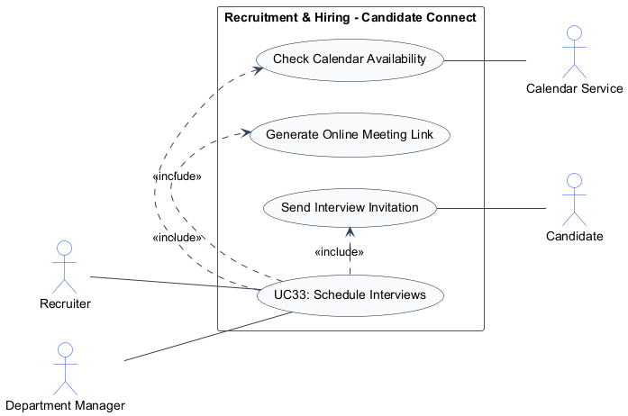

---

### UC34: Submit Interview Scorecards & Feedback
**Description:** Complete post-interview candidate evaluation scorecards and record hiring recommendations.

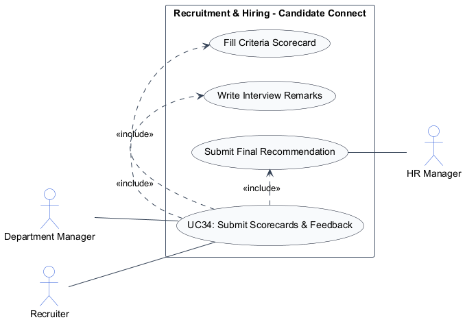

---

### UC35: Generate & Send Job Offer Letters
**Description:** Generate standardized job offer letters and send them to selected candidates for digital acceptance.

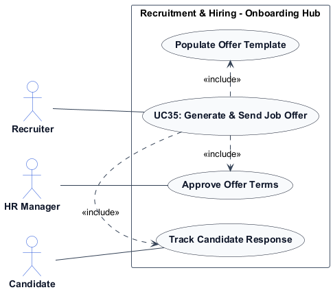

---

### UC36: Collect Pre-Hire Information
**Description:** Collect pre-onboarding personal details, bank account numbers, and ID document scans from accepted candidates.

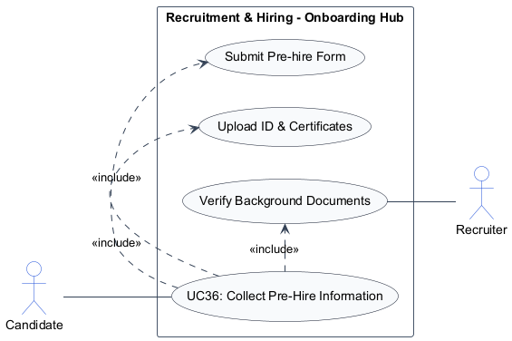

---

# 🏢 Module: Performance & OKRs

### UC37: Align Strategic Goals & Department OKRs
**Description:** Define corporate strategic objectives and align them with department and individual OKR trees.

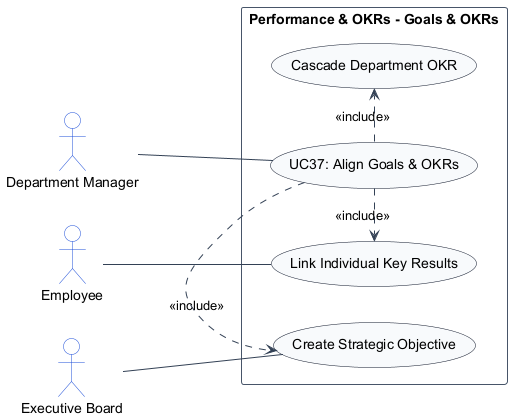

---

### UC38: Update Key Result Progress
**Description:** Log progress updates on individual key results and track real-time goal completion percentages.

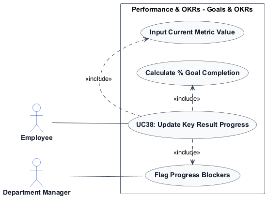

---

### UC39: Initiate 360-Degree Performance Reviews
**Description:** Launch 360-degree performance evaluation cycles involving self, peer, subordinate, and manager reviews.

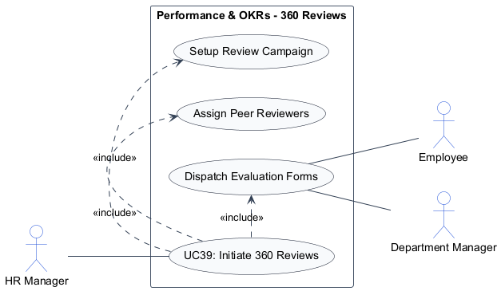

---

### UC40: Submit Peer & Self Appraisals
**Description:** Complete self-appraisals and provide constructive peer feedback using competency scoring grids.

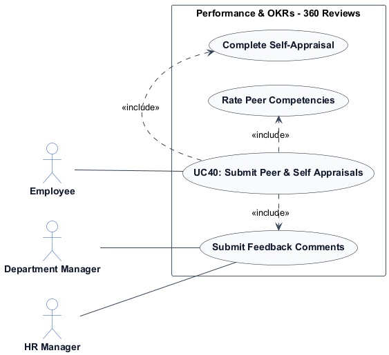

---

### UC41: Record 1-on-1 Coaching Notes & Actions
**Description:** Schedule 1-on-1 coaching sessions, document discussion notes, and assign actionable follow-up items.

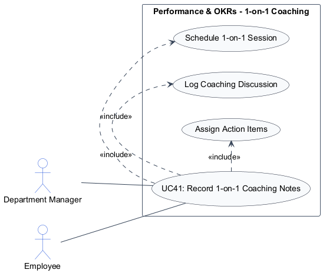

---

### UC42: Send Peer Recognition & Kudos
**Description:** Send public peer appreciation badges (Kudos) and reward points on the company social feed.

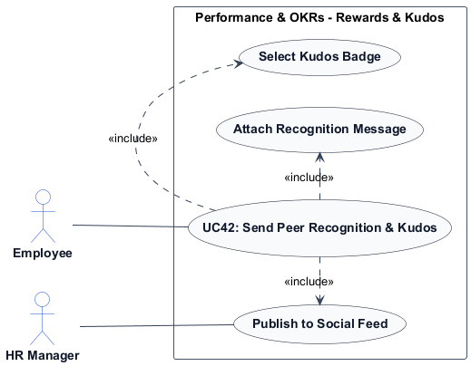

---

# 🏢 Module: Projects & Task Management

### UC43: Create Projects & Define Milestones
**Description:** Create new project workspaces, define financial budgets, and establish key deliverable milestones.

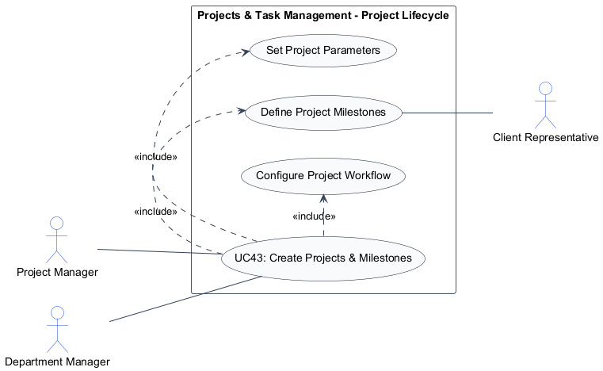

---

### UC44: Assign Team Members to Projects
**Description:** Allocate team members to projects with specific project roles and time allocation percentages.

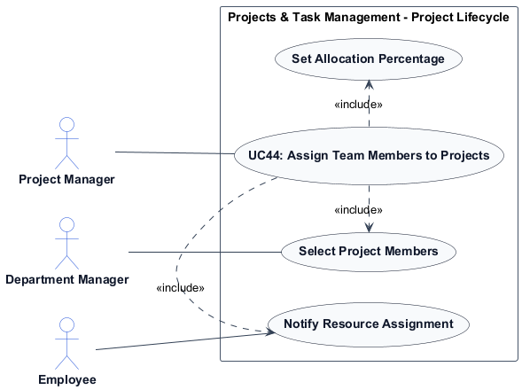

---

### UC45: Assign & Track Project Task Status
**Description:** Assign task items to team members and monitor real-time task completion on Gantt charts or Kanban boards.

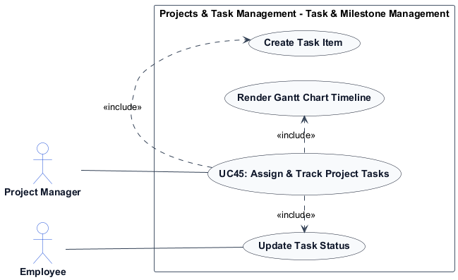

---

### UC46: Log Billable Hours per Project
**Description:** Log daily worked hours per project task and differentiate between billable and non-billable time.

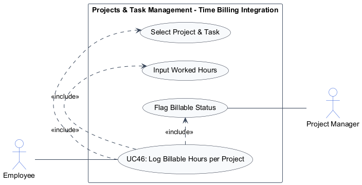

---

### UC47: Manage Project Expenses & Billing
**Description:** Track non-labor project expenses and generate draft client billing invoices for accounting approval.

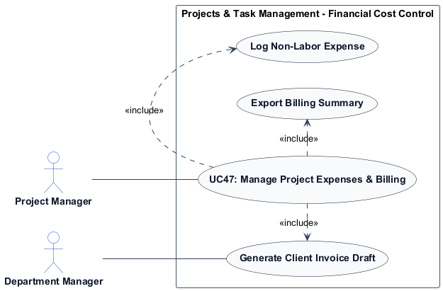

---

### UC48: Generate Project Profitability Reports
**Description:** Compute net profit margins by comparing project client revenues against labor costs and overheads.

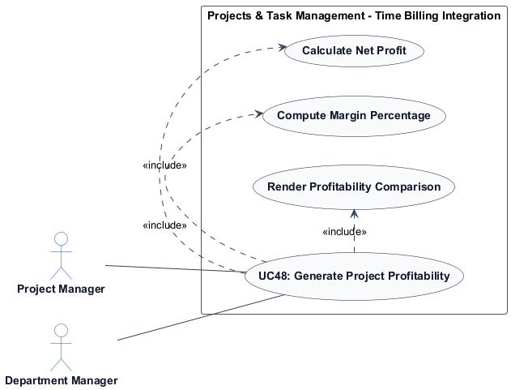

---

# 🏢 Module: Platform & Security (Web)

### UC49: Authenticate User & Single Sign-On (SSO)
**Description:** Authenticate users via local credentials or Enterprise SSO (OAuth2/OIDC/SAML2) with JWT sessions.

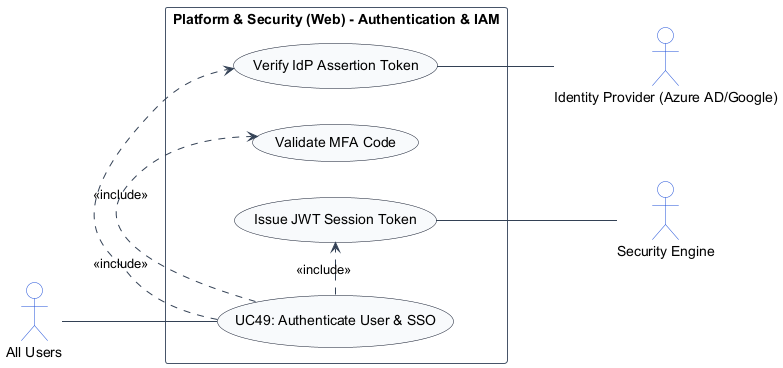

---

### UC50: Manage Roles & Permissions (RBAC)
**Description:** Define custom user roles, set fine-grained CRUD permissions, and enforce data scope boundaries.

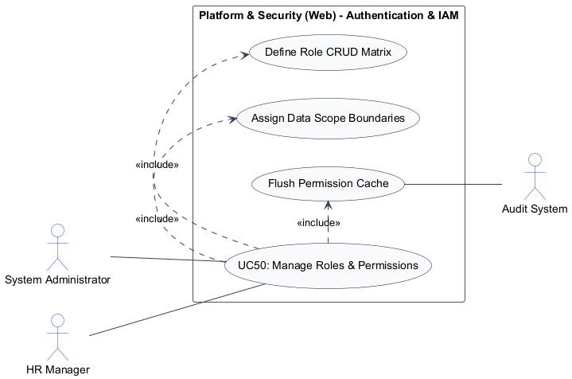

---

### UC51: Manage Integration API Keys & Webhooks
**Description:** Provision API keys, configure IP whitelist rules, rate limits, and HTTPS webhook callback endpoints.

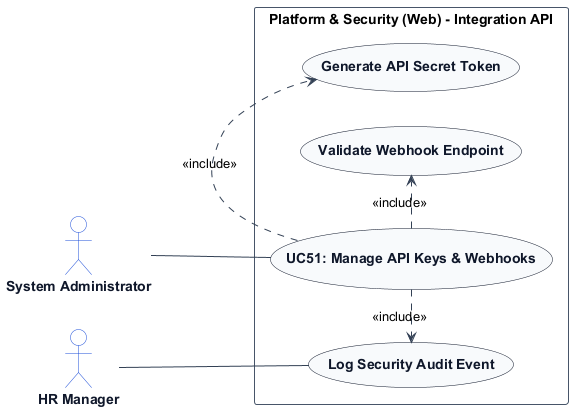

---

### UC52: Configure Email & SMS Notification Templates
**Description:** Configure dynamic email and SMS notification templates with template placeholders.

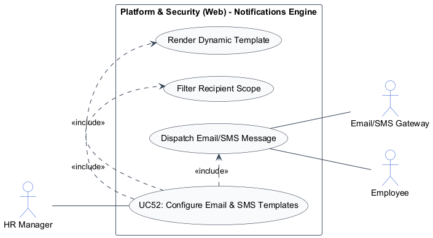

---

### UC53: Configure Data Masking & Encryption
**Description:** Configure dynamic UI data masking and AES-256 field-level database encryption for sensitive PII data.

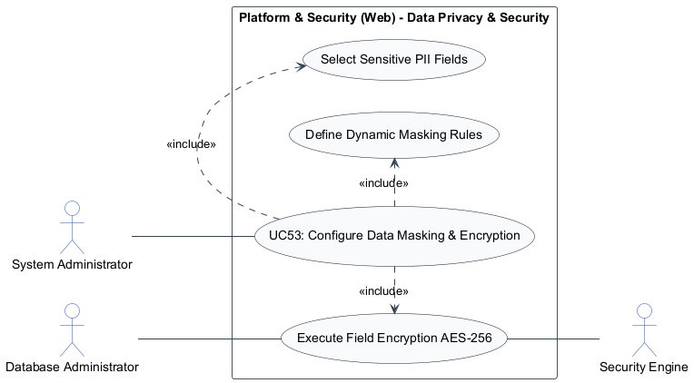

---

# 🏢 Module: Analytics & BI Reporting

### UC54: Build Custom HR Reports
**Description:** Design custom HR reports using drag-and-drop field selection, filter criteria, and chart visualizations.

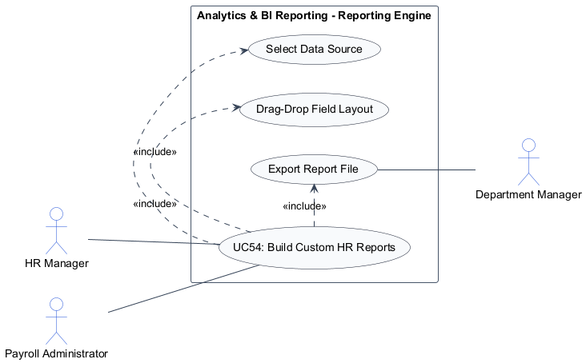

---

### UC55: Schedule Automated Report Delivery
**Description:** Set up automated cron schedules to generate and email PDF/Excel HR reports to management.

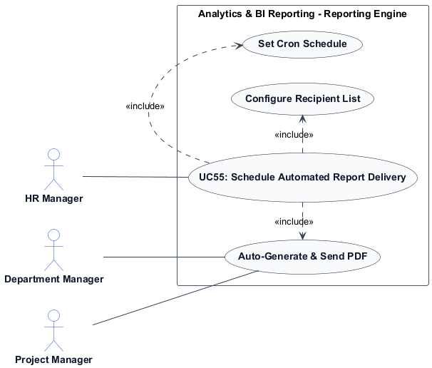

---

### UC56: View Headcount & Payroll Cost Dashboard
**Description:** View executive dashboards displaying real-time headcount trends, total payroll spend, and budget variances.

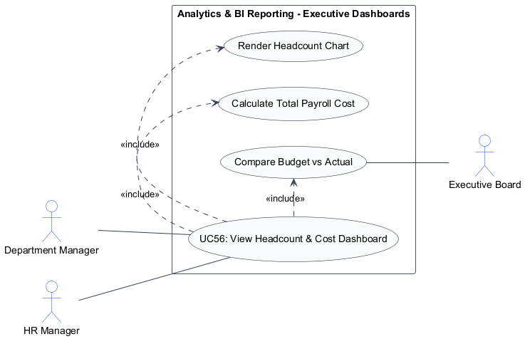

---

### UC57: Analyze Turnover & Retention Metrics
**Description:** Analyze voluntary and involuntary employee turnover rates, exit reason breakdowns, and retention trends.

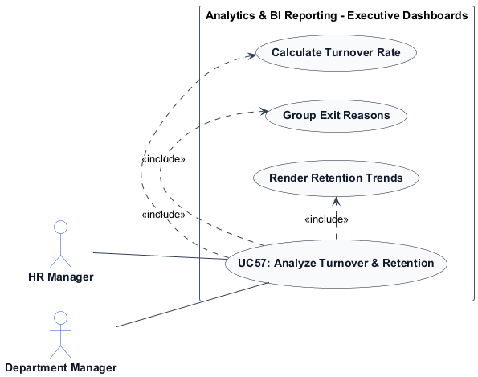

---

# 🏢 Module: Compliance & Audit

### UC58: Audit Labor Law Compliance
**Description:** Scan system data for labor law compliance risks, such as overtime hour limits and contract renewals.

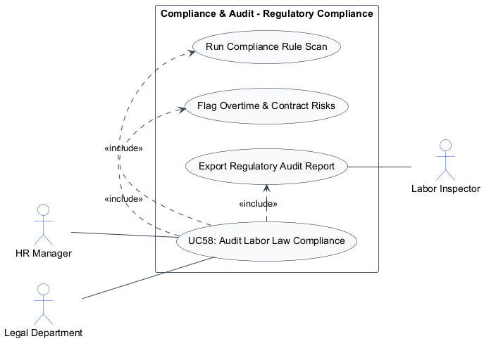

---

### UC59: Inspect System Audit Logs
**Description:** Search, filter, and inspect immutable system audit trail logs for security and compliance audits.

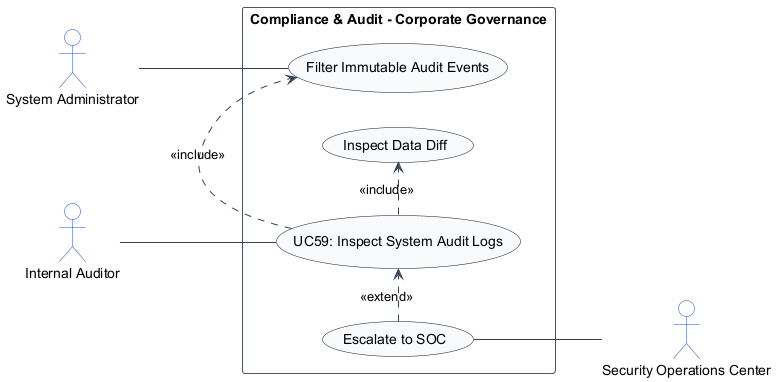

---

### UC60: Report Policy Violations & Grievances
**Description:** Submit anonymous policy violation reports and encrypted grievance tickets to the Ethics Committee.

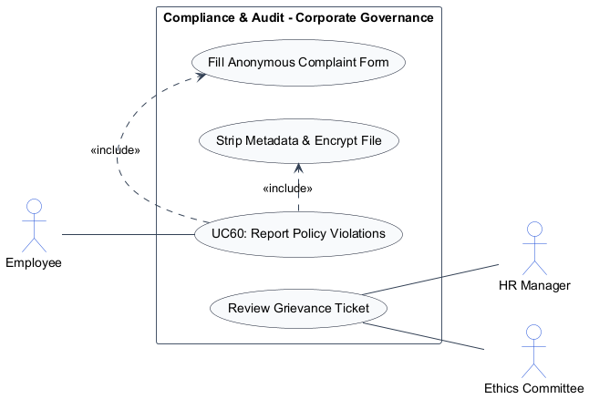

---
