## 📑 Table of Contents

- [Executive Overview](#-executive-overview)
- [Ecosystem Summary Matrix](#-ecosystem-summary-matrix)
- [System Architecture Blueprint](#-system-architecture-blueprint)
- [Role-Based Access Topology](#-role-based-access-topology)
- [Core Functional Subsystems](#-core-functional-subsystems)
  - [1. Core HR & Personnel Hub](#1-core-hr--personnel-hub)
  - [2. Workforce Intelligence & Field Telemetry](#2-workforce-intelligence--field-telemetry)
  - [3. Talent Acquisition & Candidate Pipeline](#3-talent-acquisition--candidate-pipeline)
  - [4. Time, Attendance & Absence Engine](#4-time-attendance--absence-engine)
  - [5. Compensation, Payroll & Benefits Engine](#5-compensation-payroll--benefits-engine)
  - [6. Performance Management & Growth](#6-performance-management--growth)
  - [7. Ecosystem Platform & Integration Hub](#7-ecosystem-platform--integration-hub)
  - [8. Governance, Risk & Compliance (GRC)](#8-governance-risk--compliance-grc)
  - [9. Business Intelligence & Predictive Analytics](#9-business-intelligence--predictive-analytics)
  - [10. Enterprise Project & Resource Operations](#10-enterprise-project--resource-operations)
- [Security & Technical Governance](#-security--technical-governance)

---

## 📊 Ecosystem Summary Matrix

| Subsystem Domain | Functional Focus | Use Cases | Core Target Roles | Key Capabilities |
| :--- | :--- | :---: | :--- | :--- |
| **Core HR** | Identity & Structure | **21** | HR Managers, Employees | Digital Employee Directory, Org Chart, E-Sign, Engagement |
| **Workforce Tracking** | Telemetry & Operations | **20** | Operations Leads, Field Managers | Activity Logging, Geofencing, Desktop Auditing, Field Check-in |
| **Talent Acquisition** | Recruitment Pipeline | **16** | Recruiters, Hiring Managers | Job Board Dispatch, Candidate Screening, Offer Workflows |
| **Time & Attendance** | Work Hours & Leave | **21** | All Employees, Team Leads | Clock-in/out, Shift Roster Builder, Leave Accrual Engine |
| **Payroll & Benefits** | Financial Disbursements | **16** | Payroll Officers, Finance Leads | Tax & Net Pay Calculations, Benefit Plans, Compensation Bands |
| **Performance & Growth**| Talent Evaluation | **22** | People Leads, Employees | OKR Alignment, 360 Reviews, 1-on-1 Coaching, Kudos |
| **Platform Services** | Core Infrastructure | **17** | System Administrators | OAuth/MFA, Push Notifications, REST APIs, Mobile Portal |
| **GRC & Security** | Compliance & Governance| **13** | Compliance Officers, Admins | Immutable Audit Logs, Policy Enforcement, GDPR Privacy Controls |
| **BI & Analytics** | Data Intelligence | **14** | Executives, HR Directors | Predictive Attrition Models, KPI Dashboards, Custom Reports |
| **Projects & Resources**| Workload & Costs | **16** | Project Managers, PMO | Resource Allocation, Project P&L, Task Tracking |

---

## 🏛️ System Architecture Blueprint

The high-level domain topography illustrates the interconnected modules surrounding the central Enterprise Core Engine:

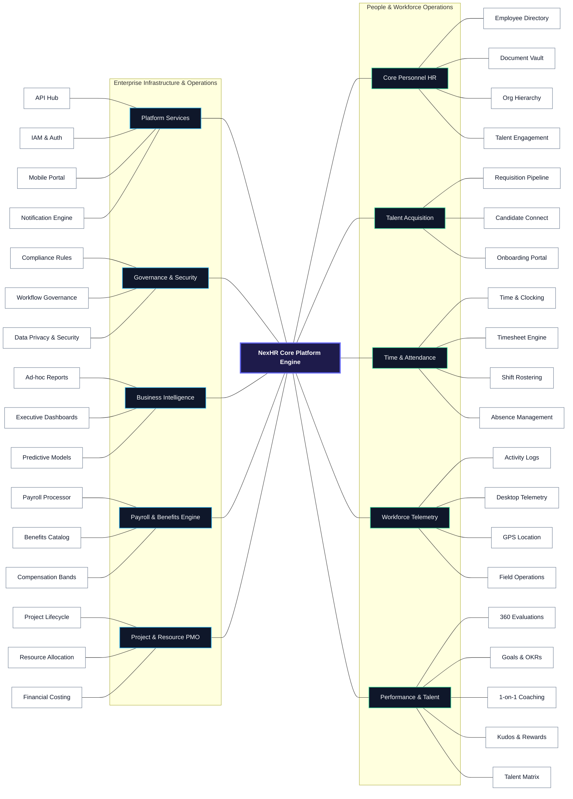

---

## 👤 Role-Based Access Topology

NexHR maps access controls cleanly across six primary enterprise personas:

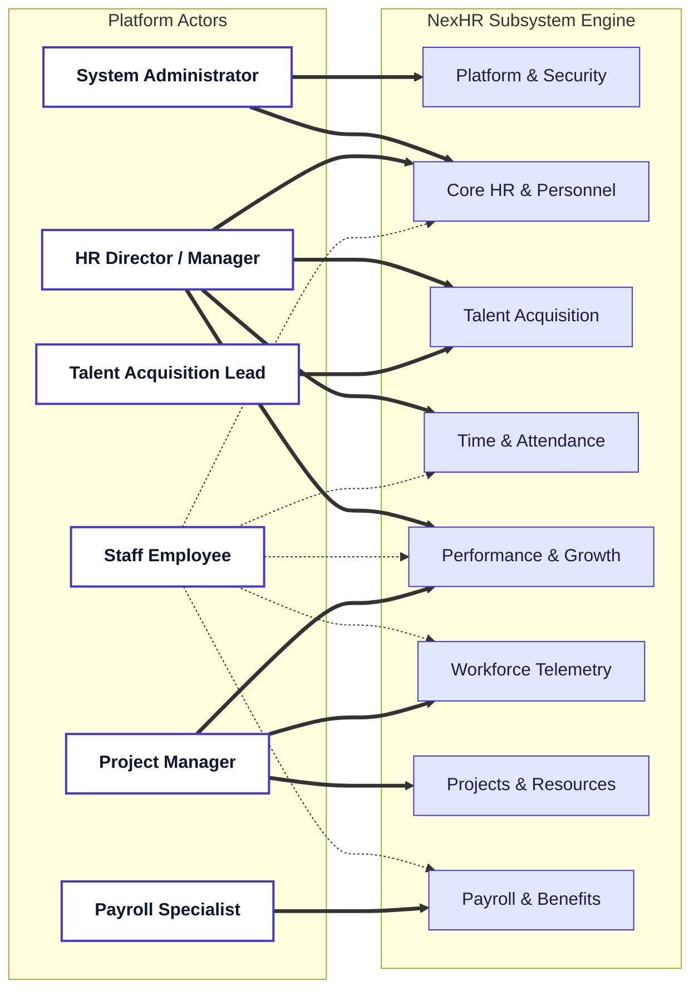

### 🔒 Access Control Matrix

| Role Persona | Platform & Security | Core HR | Talent Acquisition | Time & Attendance | Workforce Telemetry | Payroll & Benefits | Performance | Projects |
| :--- | :---: | :---: | :---: | :---: | :---: | :---: | :---: | :---: |
| **System Administrator** | 🟢 Admin | 🟢 Admin | ⚪ None | 🟡 View | 🟡 View | ⚪ None | ⚪ None | ⚪ None |
| **HR Director / Manager** | 🟡 View | 🟢 Full | 🟢 Full | 🟢 Full | 🟡 View | 🟡 View | 🟢 Full | ⚪ None |
| **Talent Acquisition Lead**| ⚪ None | 🟡 View | 🟢 Full | ⚪ None | ⚪ None | ⚪ None | ⚪ None | ⚪ None |
| **Staff Employee** | 🔵 Self | 🔵 Self | ⚪ None | 🔵 Self | 🔵 Self | 🔵 Self | 🔵 Self | 🔵 Self |
| **Project Lead / PM** | ⚪ None | 🟡 View | ⚪ None | 🟡 View | 🟢 Manage | ⚪ None | 🟢 Manage | 🟢 Full |
| **Payroll Specialist** | ⚪ None | 🟡 View | ⚪ None | 🟡 View | ⚪ None | 🟢 Full | ⚪ None | ⚪ None |

*Legend: 🟢 Full Admin/Manage | 🟡 Read-Only Audit | 🔵 Employee Self-Service | ⚪ Restricted Access*

---

## 🧩 Core Functional Subsystems

---

### 1. Core HR & Personnel Hub

The **Core HR Hub** maintains the centralized record of organizational structures, digital personnel identity files, legal document compliance, and employee culture initiatives.

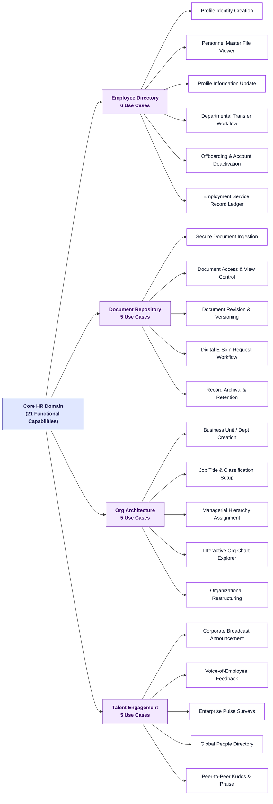

#### 📋 Detailed Use Case Catalog - Core HR

| Capability Name | Description & Workflow Scope | Primary Role |
| :--- | :--- | :--- |
| Profile Identity Creation | Provision new employee profile with biographical and job attributes. | HR Manager |
| Personnel File Viewer | Search and inspect comprehensive employee information dossiers. | HR / Manager |
| Profile Information Update | Modify contact details, personal bio, address, and emergency contacts. | Employee / HR |
| Departmental Transfer | Execute lateral or vertical internal job role & location movements. | HR Manager |
| Account Offboarding | Perform exit workflows, asset handover checks, and profile archival. | HR Manager |
| Service Record Ledger | Audit historical positions, salary progression, and milestone logs. | HR Manager |
| Secure Document Ingestion | Upload legal contracts, tax forms, certificates, and identity docs. | Employee / HR |
| Document Access Control | Enforce strict permission viewing based on document sensitivity classification. | System / HR |
| Revision & Versioning | Track document modifications with timestamped version histories. | HR Manager |
| Digital E-Sign Request | Dispatch binding contract signature requests with compliance logs. | HR / Recruiter |
| Archival & Retention | Apply corporate retention rules and move dormant files to cold storage. | Admin / HR |
| Dept & Unit Creation | Define corporate divisions, branches, and functional departments. | HR Admin |
| Job Classification | Maintain job family catalog, position tiers, and skill prerequisites. | HR Admin |
| Hierarchy Assignment | Link employees to direct managers and matrix reporting leads. | HR Manager |
| Org Chart Explorer | Render interactive, dynamic organizational tree diagrams. | All Staff |
| Org Restructuring | Batch-reassign team structures during corporate re-organizations. | HR Admin |
| Broadcast News | Publish company-wide announcements with target audience filters. | HR Manager |
| Employee Feedback | Submit confidential or open operational feedback to management. | Employee |
| Enterprise Pulse Surveys | Build, distribute, and collect analytics on team satisfaction surveys. | HR Manager |
| Global People Directory | Search team members by name, skill, location, or department. | All Staff |
| Peer Recognition | Send public praise badges and recognition notes to colleagues. | All Staff |

---

### 2. Workforce Intelligence & Field Telemetry

This subsystem delivers automated operational telemetry, field worker dispatching, computer activity verification, and geo-location tracking for distributed workforces.

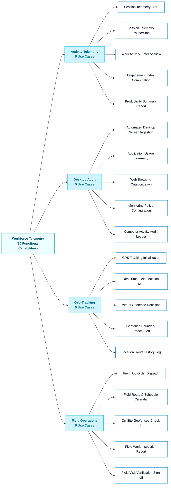

#### 📋 Detailed Use Case Catalog - Workforce Telemetry

| Capability Name | Description & Workflow Scope | Primary Role |
| :--- | :--- | :--- |
| Telemetry Start | Initiate active time and task telemetry recording session. | Employee / Field |
| Telemetry Stop | Pause or terminate active work telemetry session. | Employee / Field |
| Activity Timeline View | Inspect visual breakdown of active vs idle time intervals. | Lead / Employee |
| Engagement Index | Calculate active keyboard/mouse activity metrics over shift duration. | System |
| Productivity Summary | Compile aggregated daily/weekly productivity scoring reports. | Project Lead |
| Screen Ingestion | Capture randomized or trigger-based encrypted desktop screenshots. | System Agent |
| App Usage Telemetry | Monitor execution time across productivity software vs non-work apps. | System Agent |
| Web Categorization | Track website visits and classify domain usefulness tiers. | System Agent |
| Monitoring Config | Define privacy thresholds, blur settings, and active tracking windows. | System Admin |
| Activity Audit Ledger | Review compliance logs of computer usage data for audit verification. | Project Manager |
| GPS Tracking Init | Enable location telemetry on authorized mobile field devices. | Field Worker |
| Real-Time Location Map | View live map displaying active positions of field operation teams. | Dispatcher / PM |
| Geofence Builder | Draw perimeter boundaries around client job sites or company facilities. | Operations Lead |
| Boundary Breach Alert | Trigger automated notifications when field staff enter/exit geofences. | System Alert |
| Route History Log | Reconstruct travel routes and time spent at designated coordinates. | Operations Lead |
| Job Order Dispatch | Assign on-site service jobs, instructions, and customer SLA targets. | Project Manager |
| Field Calendar View | Access scheduled customer visits, job queues, and route optimization. | Field Worker |
| On-Site Check-In | Validate arrival at customer site using GPS coordinates. | Field Worker |
| Field Inspection Report | Submit job completion forms, customer signatures, and site photos. | Field Worker |
| Visit Verification | Verify completion of field job against dispatch criteria. | Project Manager |

---

### 3. Talent Acquisition & Candidate Pipeline

Manages end-to-end recruitment operations—from requisition posting and candidate scoring to interview coordination and new-hire onboarding checklists.

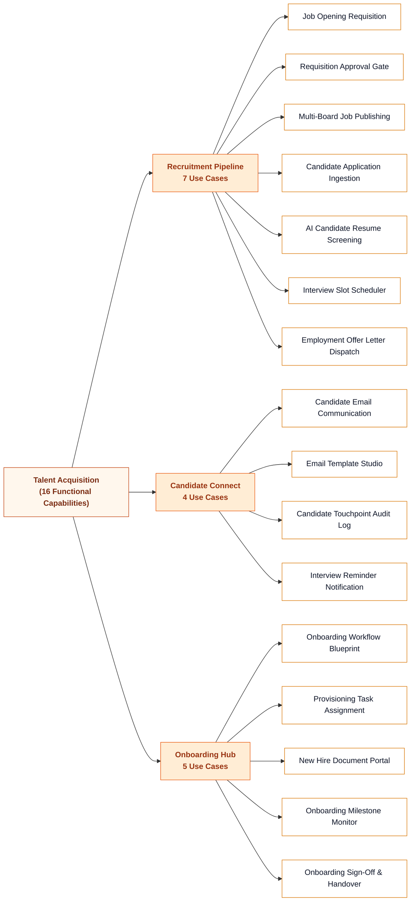

#### 📋 Detailed Use Case Catalog - Talent Acquisition

| Capability Name | Description & Workflow Scope | Primary Role |
| :--- | :--- | :--- |
| Job Requisition | Create formal request for new headcount or replacement hiring. | Hiring Manager |
| Requisition Approval | Route job opening request through finance and HR budget gates. | HR Lead / Finance |
| Job Publishing | Dispatch job postings to careers portal, LinkedIn, and job boards. | Recruiter |
| Application Ingestion | Capture job applications, cover letters, and candidate profiles. | System / Candidate |
| Resume Screening | Evaluate candidate suitability scores against role requirements. | Recruiter |
| Interview Scheduler | Coordinate panel availability and dispatch calendar invitations. | Recruiter |
| Offer Letter Dispatch | Generate compensation offer packages with digital sign-off. | HR Manager |
| Candidate Messaging | Send direct updates, interview invites, or regret notices to applicants. | Recruiter |
| Template Studio | Create standardized, branded communication templates for messaging. | Talent Lead |
| Interaction Audit Log | Record history of calls, notes, and emails sent to candidate. | Recruiter |
| Interview Reminders | Send automated SMS/Email reminders prior to scheduled interviews. | System |
| Onboarding Blueprint | Build structured 30-60-90 day orientation plans by role category. | HR Manager |
| Task Assignment | Dispatch IT equipment setup, badge issuance, and training tasks. | Ops / IT Lead |
| Document Portal | Ingest tax forms, banking details, and identity proofs from new hires. | New Hire |
| Milestone Monitor | Track completion status of assigned onboarding checklist items. | Manager / HR |
| Onboarding Handover | Formalize successful probation completion and handover to manager. | Manager |

---

### 4. Time, Attendance & Absence Engine

Handles physical & digital attendance logging, work schedules, timesheet calculations, overtime processing, and leave accruals.

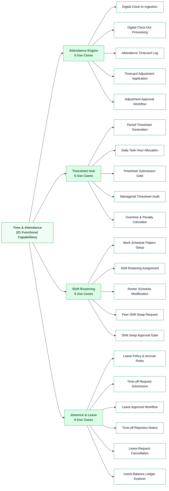

#### 📋 Detailed Use Case Catalog - Time & Attendance

| Capability Name | Description & Workflow Scope | Primary Role |
| :--- | :--- | :--- |
| Clock-In Ingestion | Capture check-in timestamps via web portal, mobile app, or biometric kiosk. | Employee |
| Clock-Out Processing | Record shift completion timestamp and calculate gross shift duration. | Employee |
| Timecard Log | Inspect daily raw punch records, late arrivals, and early departures. | Employee / Lead |
| Timecard Correction | Submit request to fix missed punch-in/out entries with justification notes. | Employee |
| Correction Approval | Managerial sign-off gateway for manual attendance adjustments. | Manager |
| Timesheet Generation | Auto-populate weekly/bi-weekly timesheet drafts from attendance logs. | System |
| Hour Allocation | Distribute worked hours against specific client projects or cost codes. | Employee |
| Timesheet Submission | Submit completed period timesheets for supervisor validation. | Employee |
| Timesheet Audit | Review, approve, or reject employee timesheets with feedback notes. | Manager |
| Overtime Calculator | Automatically compute standard vs overtime hours based on labor rules. | Payroll / System |
| Schedule Pattern Setup | Configure standard shift templates (e.g. 9-to-5, rotating, graveyard). | HR / Ops Lead |
| Shift Assignment | Assign employees or teams to upcoming monthly work rosters. | Shift Supervisor |
| Roster Modification | Update shift times or reassign staff to cover emergency operational gaps. | Shift Supervisor |
| Shift Swap Request | Initiate shift trade agreement between qualified peer employees. | Employee |
| Shift Swap Approval | Approve peer-to-peer shift exchange without breaching labor hour limits. | Shift Supervisor |
| Leave Policy Engine | Configure annual leave entitlements, carry-over rules, and accrual rates. | HR Admin |
| Time-off Submission | Apply for vacation, sick leave, or parental time off with attachments. | Employee |
| Leave Approval Gate | Manager sign-off workflow for time-off applications. | Manager |
| Time-off Rejection | Deny leave request with explanatory comments and coverage reasons. | Manager |
| Leave Cancellation | Revoke previously approved time-off and reinstate accrual balance. | Employee / HR |
| Leave Ledger | Inspect real-time accrued, taken, and remaining time-off balances. | Employee / HR |

---

### 5. Compensation, Payroll & Benefits Engine

Calculates complex gross-to-net pay runs, tax withholdings, statutory benefits, insurance enrollments, and salary bands.

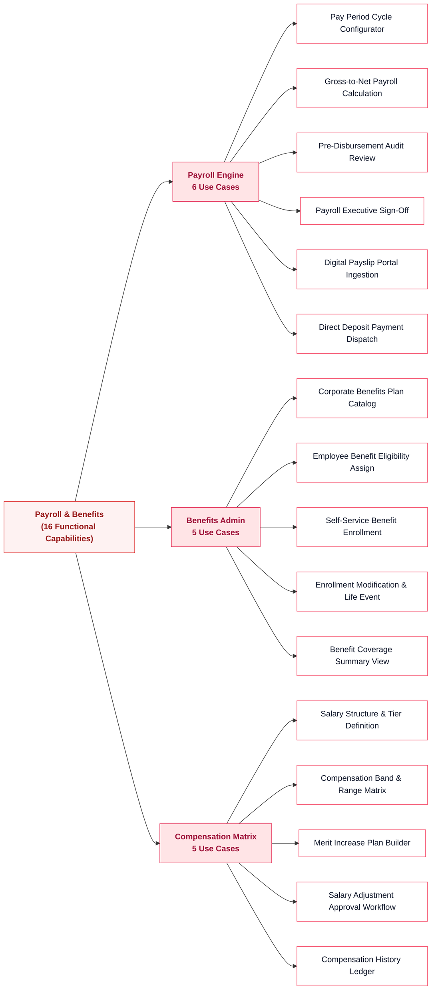

#### 📋 Detailed Use Case Catalog - Payroll & Benefits

| Capability Name | Description & Workflow Scope | Primary Role |
| :--- | :--- | :--- |
| Pay Cycle Config | Set up monthly, semi-monthly, or bi-weekly pay period calendars. | Payroll Officer |
| Payroll Calculation | Execute gross pay, tax, insurance, deductions, and net payout algorithms. | Payroll Engine |
| Pre-Disbursement Review | Audit payroll run outputs for anomalies, variances, or missing data. | Payroll Lead |
| Executive Sign-Off | Authorize financial execution and funding of calculated pay run. | Finance Director |
| Payslip Ingestion | Generate encrypted digital pay slips accessible via self-service portal. | System |
| Payment Dispatch | Export bank NACHA/SEPA files or trigger direct deposit payment gateways. | Payroll Officer |
| Benefits Catalog | Configure medical, dental, 401(k)/pension, and wellness plan packages. | Benefits Admin |
| Eligibility Assign | Link specific benefit options to employee groups based on grade/tenure. | Benefits Admin |
| Open Enrollment | Select plan options and coverage tiers during annual enrollment windows. | Employee |
| Life Event Update | Modify benefit elections due to qualifying events (marriage, birth). | Employee / HR |
| Coverage Summary | View enrolled plan details, payroll deduction values, and dependents. | Employee |
| Salary Structure | Define base salary models, hourly rates, and variable bonus rules. | HR Director |
| Pay Band Matrix | Establish minimum, midpoint, and maximum salary bands per job tier. | HR Director |
| Merit Plan Builder | Model annual salary review budgets and merit distribution curves. | HR Manager |
| Salary Adjustment | Submit and approve base pay increases or promotional salary adjustments. | HR / Executive |
| Compensation Ledger | Audit past salary adjustments, equity grants, and bonus disbursements. | HR Lead |

---

### 6. Performance Management & Growth

Drives organizational growth through goal cascading (OKRs), continuous feedback, multi-rater performance reviews, and talent development plans.

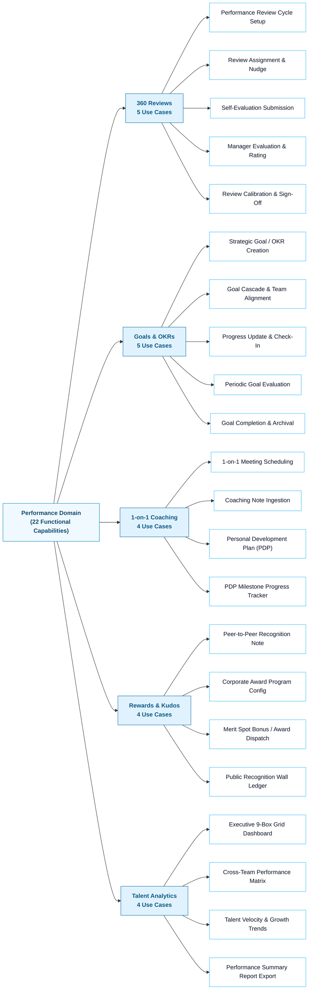

#### 📋 Detailed Use Case Catalog - Performance

| Capability Name | Description & Workflow Scope | Primary Role |
| :--- | :--- | :--- |
| Review Cycle Setup | Configure annual or quarterly evaluation forms, weightings, and timelines. | HR Manager |
| Review Assignment | Launch review tasks to employees, managers, and peer reviewers. | HR Manager |
| Self-Evaluation | Complete self-assessment on accomplishments, strengths, and goals. | Employee |
| Manager Rating | Provide manager ratings, feedback comments, and competency scores. | Manager |
| Review Calibration | Calibrate ratings across teams and formalize sign-off session. | HR / Executive |
| OKR Creation | Define SMART performance targets, key results, and weighting metrics. | Employee / Lead |
| Goal Cascading | Link team and individual goals to overarching corporate strategic OKRs. | Department Lead |
| Progress Check-In | Log weekly/monthly progress percentages and status updates on key results. | Employee |
| Goal Evaluation | Assess final achievement score at the end of the goal cycle. | Manager |
| Goal Archival | Mark completed goals as achieved and archive closed initiatives. | Employee |
| 1-on-1 Scheduling | Schedule regular sync meetings between manager and direct reports. | Manager / Staff |
| Coaching Notes | Record private notes, action items, and growth feedback from 1-on-1s. | Manager |
| PDP Creation | Build tailored skill development plans and training programs. | Employee / Lead |
| PDP Tracking | Track progress on assigned certifications, courses, and stretch assignments. | Employee |
| Peer Recognition | Send kudos badges and public appreciation notes to teammates. | All Staff |
| Award Program Setup | Configure company award categories (e.g. Innovator of the Month). | HR Manager |
| Award Dispatch | Bestow formal recognition awards along with financial/gift points. | HR Manager |
| Recognition Wall | Display company-wide wall of recognition celebrating employee wins. | All Staff |
| 9-Box Grid Dashboard | Map workforce on Performance vs Potential 9-Box talent matrix. | HR Executive |
| Performance Matrix | Compare performance distributions across business units or locations. | HR Manager |
| Growth Analytics | Identify upward performance trajectories and potential flight risks. | HR Director |
| Report Export | Export comprehensive performance audit files for executive reviews. | HR Manager |

---

### 7. Ecosystem Platform & Integration Hub

Provides core foundational infrastructure including IAM, Single Sign-On (SSO), mobile applications, RESTful integration gateways, and notification engines.

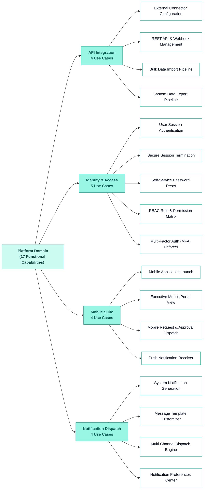

#### 📋 Detailed Use Case Catalog - Platform Infrastructure

| Capability Name | Description & Workflow Scope | Primary Role |
| :--- | :--- | :--- |
| Connector Config | Establish OAuth2 links to external ERPs, CRMs, and accounting software. | System Admin |
| API & Webhooks | Configure API keys, webhooks, and rate-limiting rules for integrations. | Developer / Admin |
| Bulk Data Import | Ingest legacy employee datasets via CSV/JSON schema validation pipelines. | System Admin |
| Data Export | Extract system data into standardized enterprise reporting formats. | Admin / Analyst |
| Session Auth | Authenticate user credentials via OAuth 2.0 / SAML Single Sign-On. | All Users |
| Session Terminate | Invalidate active user tokens on logout or period of inactivity. | All Users |
| Password Reset | Self-service password recovery with secure OTP verification. | All Users |
| RBAC Matrix | Define system roles, module permissions, and data access scopes. | System Admin |
| MFA Enforcer | Require TOTP/SMS secondary verification for high-privilege accounts. | System Admin |
| Mobile Launch | Launch native iOS/Android mobile client with biometric auth. | All Users |
| Mobile Portal | Access key personal widgets, pay stubs, and schedules on mobile devices. | All Users |
| Mobile Approval | Approve leave, timesheets, and expense claims directly via mobile. | Manager |
| Push Receiver | Receive real-time push alerts for pending tasks or emergency notices. | All Users |
| Notification Gen | Trigger event-driven alert objects upon system status changes. | System |
| Template Customizer | Design HTML email, SMS, and push notification layout templates. | System Admin |
| Dispatch Engine | Broadcast queued notifications across selected transport channels. | System Engine |
| Preference Center | Manage personal notification channel subscriptions and frequency. | All Users |

---

### 8. Governance, Risk & Compliance (GRC)

Ensures organizational adherence to regional labor laws, statutory data privacy directives (GDPR), approval workflows, and immutable security audit logs.

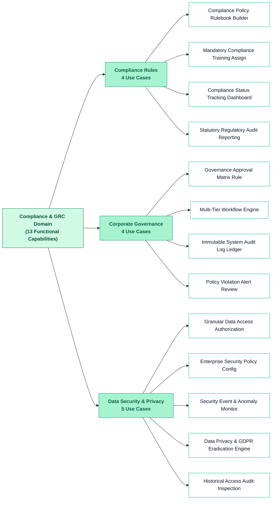

#### 📋 Detailed Use Case Catalog - Governance, Risk & Compliance

| Capability Name | Description & Workflow Scope | Primary Role |
| :--- | :--- | :--- |
| Policy Rulebook | Build mandatory regulatory compliance policies and labor standards. | Compliance Lead |
| Training Assign | Automatically assign statutory safety/anti-harassment training tasks. | HR / Compliance |
| Status Tracking | Monitor employee compliance completion percentages across departments. | Compliance Lead |
| Audit Reporting | Export formal compliance readiness audit filings for legal regulators. | Compliance Lead |
| Approval Matrix | Define multi-level authorization rules based on financial/role thresholds. | Governance Lead |
| Workflow Engine | Execute step-by-step approval routing for high-impact platform requests. | System Engine |
| Audit Log Ledger | Maintain immutable log of all user creation, edits, and deletion events. | Security Auditor |
| Violation Review | Flag and investigate unauthorized access attempts or policy breaches. | Compliance Lead |
| Data Authorization | Restrict sensitive field visibility (e.g. SSN, bank details) by role. | System Admin |
| Security Policy | Configure password complexity, session timeouts, and IP white-listing. | Security Admin |
| Anomaly Monitor | Detect suspicious login locations, mass exports, or brute-force attempts. | Security Admin |
| GDPR Engine | Process "Right to be Forgotten" and data portability requests securely. | Data Privacy Officer |
| Access Audit | Review historical logs detailing who accessed specific personnel files. | Security Auditor |

---

### 9. Business Intelligence & Predictive Analytics

Delivers real-time executive dashboards, customizable ad-hoc reporting engines, and machine learning models for attrition prediction and workforce planning.

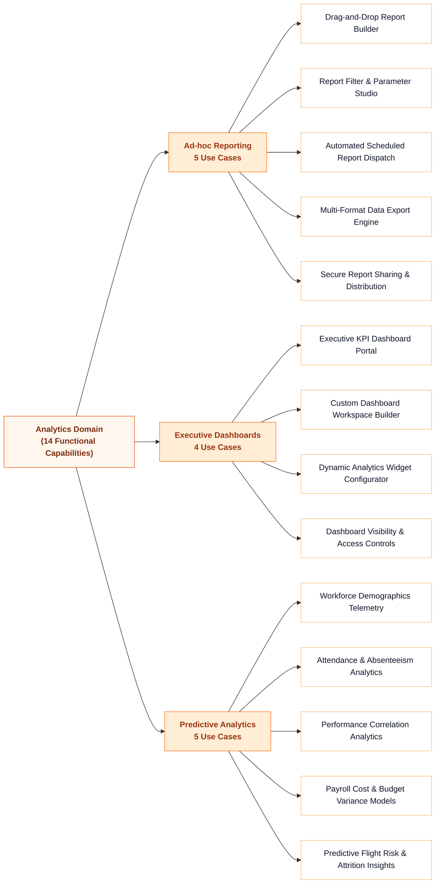

#### 📋 Detailed Use Case Catalog - BI & Analytics

| Capability Name | Description & Workflow Scope | Primary Role |
| :--- | :--- | :--- |
| Report Builder | Construct custom cross-modular reports using visual query builders. | Business Analyst |
| Filter Studio | Apply complex date, department, location, and status query filters. | Business Analyst |
| Report Scheduler | Automate recurring report generation and email distribution to management. | Business Analyst |
| Export Engine | Render report output into PDF, XLSX, CSV, or interactive HTML files. | All Users |
| Report Sharing | Share created report templates with designated management groups. | Analyst / HR |
| Executive KPI Portal | Monitor real-time headcount, turnover, open roles, and payroll totals. | C-Level / VP HR |
| Dashboard Builder | Assemble personalized dashboard layouts with drag-and-drop tiles. | All Managers |
| Widget Configurator | Customize chart types (bar, line, donut, heatmaps) and metric targets. | All Managers |
| Dashboard Security | Restrict metric visibility on dashboards based on viewer authorization. | System Admin |
| Demographics Telemetry | Analyze gender diversity, age distributions, and tenure metrics. | HR Director |
| Absenteeism Analytics | Identify sickness patterns, chronic tardiness, and lost-hour costs. | HR Manager |
| Performance Correlation | Correlate training investment against employee performance output. | HR Manager |
| Budget Variance | Track actual payroll expenditure against quarterly fiscal forecasts. | Finance Lead |
| Attrition Insights | Machine-learning model predicting employee turnover probability. | HR Executive |

---

### 10. Enterprise Project & Resource Operations

Connects project planning, task management, resource utilization, and project financial controls with workforce tracking and payroll data.

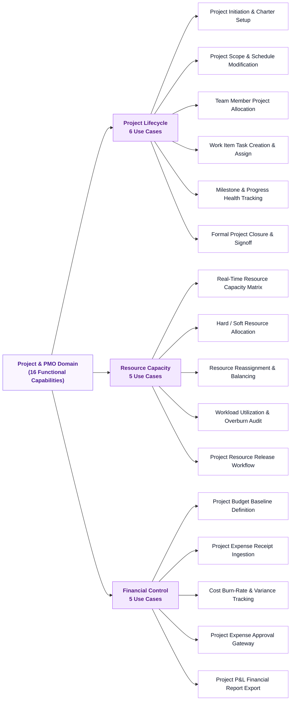

#### 📋 Detailed Use Case Catalog - Project & Resource Operations

| Capability Name | Description & Workflow Scope | Primary Role |
| :--- | :--- | :--- |
| Project Initiation | Provision new client or internal project workspace with deliverables. | Project Manager |
| Scope Modification | Update project timelines, milestone dates, and scope requirements. | Project Manager |
| Team Allocation | Assign project roles (e.g. Lead, Architect, Developer) to staff. | Project Manager |
| Task Creation | Break down project scope into assignable work items and sprints. | Project Manager |
| Health Tracking | Monitor Gantt charts, burndown rates, and milestone completion status. | PM / Stakeholders |
| Project Closure | Archive project files, complete post-mortem audit, and sign off. | Project Manager |
| Capacity Matrix | View real-time availability and skill inventories across all staff. | Resource Lead |
| Resource Allocation | Reserve team members for upcoming projects based on estimated hours. | Resource Lead |
| Resource Rebalancing | Reassign staff between projects to eliminate bottlenecks or overbooking. | Resource Lead |
| Workload Audit | Track billable vs non-billable utilization rates across departments. | PMO Lead |
| Resource Release | De-allocate completed team members back into the unassigned bench pool. | Project Manager |
| Budget Baseline | Define initial capital, labor, and operational budget allocations. | PM / Finance |
| Expense Ingestion | Log project-related vendor invoices, travel receipts, and billable items. | Team Member |
| Cost Burn Tracking | Calculate real-time actual spend vs budget allocation variances. | Project Manager |
| Expense Approval | Review and approve submitted project expense claims. | Project Manager |
| P&L Financial Export | Generate profit and loss statements per project or client account. | Finance Lead |

---

