## HR Platform Feature Mindmap

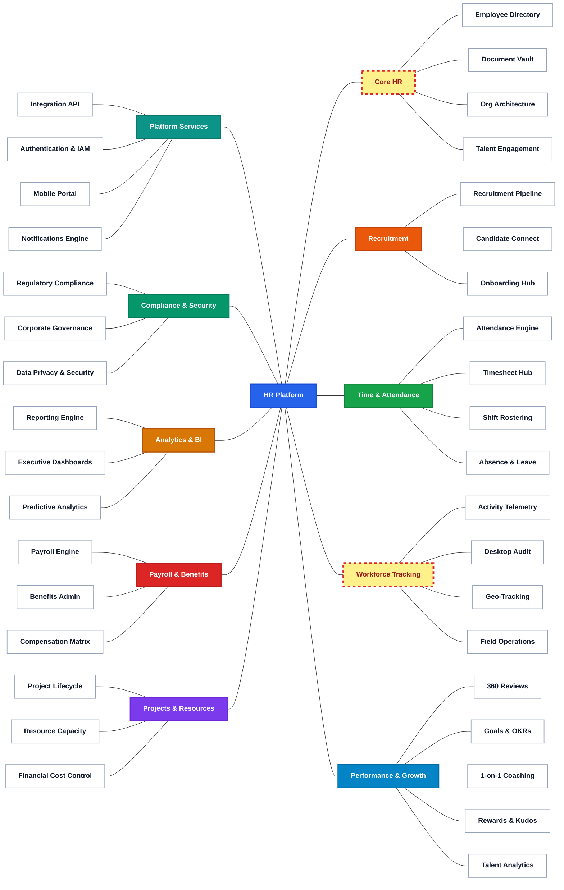
```mermaid
flowchart LR

    %% =========================
    %% CENTER MODULE
    %% =========================
    HR["HR Platform"]

    %% =========================
    %% LEFT MAIN MODULES
    %% =========================
    PLATFORM["Platform Services"]
    COMPLIANCE["Compliance & Security"]
    ANALYTICS["Analytics & BI"]
    PAYROLL["Payroll & Benefits"]
    PROJECTS["Projects & Resources"]

    PLATFORM --- HR
    COMPLIANCE --- HR
    ANALYTICS --- HR
    PAYROLL --- HR
    PROJECTS --- HR

    %% Platform features
    Integration["Integration API"] --- PLATFORM
    Authentication["Authentication & IAM"] --- PLATFORM
    Mobile["Mobile Portal"] --- PLATFORM
    Notifications["Notifications Engine"] --- PLATFORM

    %% Compliance features
    ComplianceFeature["Regulatory Compliance"] --- COMPLIANCE
    Governance["Corporate Governance"] --- COMPLIANCE
    Security["Data Privacy & Security"] --- COMPLIANCE

    %% Analytics features
    Reporting["Reporting Engine"] --- ANALYTICS
    Dashboards["Executive Dashboards"] --- ANALYTICS
    AnalyticsFeature["Predictive Analytics"] --- ANALYTICS

    %% Payroll features
    PayrollFeature["Payroll Engine"] --- PAYROLL
    Benefits["Benefits Admin"] --- PAYROLL
    Compensation["Compensation Matrix"] --- PAYROLL

    %% Projects features
    ProjectManagement["Project Lifecycle"] --- PROJECTS
    ResourceManagement["Resource Capacity"] --- PROJECTS
    FinancialControl["Financial Cost Control"] --- PROJECTS

    %% =========================
    %% RIGHT MAIN MODULES
    %% =========================
    CORE["Core HR"]
    RECRUITMENT["Recruitment"]
    TIME["Time & Attendance"]
    TRACKING["Workforce Tracking"]
    PERFORMANCE["Performance & Growth"]

    HR --- CORE
    HR --- RECRUITMENT
    HR --- TIME
    HR --- TRACKING
    HR --- PERFORMANCE

    %% Core HR features (HIGHLIGHTED CORE MODULE)
    CORE --- Employee["Employee Directory"]
    CORE --- Documents["Document Vault"]
    CORE --- Organization["Org Architecture"]
    CORE --- EmployeeExperience["Talent Engagement"]

    %% Recruitment features
    RECRUITMENT --- Hiring["Recruitment Pipeline"]
    RECRUITMENT --- Communication["Candidate Connect"]
    RECRUITMENT --- Onboarding["Onboarding Hub"]

    %% Time features
    TIME --- Attendance["Attendance Engine"]
    TIME --- TimeManagement["Timesheet Hub"]
    TIME --- Scheduling["Shift Rostering"]
    TIME --- Leave["Absence & Leave"]

    %% Workforce Tracking features (HIGHLIGHTED CORE MODULE)
    TRACKING --- ActivityMonitoring["Activity Telemetry"]
    TRACKING --- ComputerMonitoring["Desktop Audit"]
    TRACKING --- LocationTracking["Geo-Tracking"]
    TRACKING --- FieldOperations["Field Operations"]

    %% Performance features
    PERFORMANCE --- Reviews["360 Reviews"]
    PERFORMANCE --- Goals["Goals & OKRs"]
    PERFORMANCE --- Coaching["1-on-1 Coaching"]
    PERFORMANCE --- Recognition["Rewards & Kudos"]
    PERFORMANCE --- Insights["Talent Analytics"]

    %% =========================
    %% STYLES & VIBRANT PALETTE
    %% =========================
    classDef center fill:#2563eb,stroke:#1d4ed8,stroke-width:3px,color:#ffffff,font-weight:bold;
    
    %% Bold Vibrant Main Module Styles
    classDef platform fill:#0d9488,stroke:#0f766e,stroke-width:2px,color:#ffffff,font-weight:bold;
    classDef compliance fill:#059669,stroke:#047857,stroke-width:2px,color:#ffffff,font-weight:bold;
    classDef analytics fill:#d97706,stroke:#b45309,stroke-width:2px,color:#ffffff,font-weight:bold;
    classDef payroll fill:#dc2626,stroke:#b91c1c,stroke-width:2px,color:#ffffff,font-weight:bold;
    classDef projects fill:#7c3aed,stroke:#6d28d9,stroke-width:2px,color:#ffffff,font-weight:bold;

    classDef recruitment fill:#ea580c,stroke:#c2410c,stroke-width:2px,color:#ffffff,font-weight:bold;
    classDef time fill:#16a34a,stroke:#15803d,stroke-width:2px,color:#ffffff,font-weight:bold;
    classDef performance fill:#0284c7,stroke:#0369a1,stroke-width:2px,color:#ffffff,font-weight:bold;

    %% DISTINCT HIGHLIGHT STYLE FOR MODIFIED / KEY CORE MODULES (Yellow fill + dashed red border)
    classDef highlight fill:#fef08a,stroke:#dc2626,stroke-width:4px,color:#991b1b,font-weight:bold,stroke-dasharray: 6 6;

    %% Sub-feature Leaf Nodes
    classDef feature fill:#ffffff,stroke:#94a3b8,stroke-width:1.5px,color:#0f172a,font-weight:bold;

    class HR center;

    class PLATFORM platform;
    class COMPLIANCE compliance;
    class ANALYTICS analytics;
    class PAYROLL payroll;
    class PROJECTS projects;

    class CORE highlight;
    class RECRUITMENT recruitment;
    class TIME time;
    class TRACKING highlight;
    class PERFORMANCE performance;

    class Integration,Authentication,Mobile,Notifications feature;
    class ComplianceFeature,Governance,Security feature;
    class Reporting,Dashboards,AnalyticsFeature feature;
    class PayrollFeature,Benefits,Compensation feature;
    class ProjectManagement,ResourceManagement,FinancialControl feature;

    class Employee,Documents,Organization,EmployeeExperience feature;
    class Hiring,Communication,Onboarding feature;
    class Attendance,TimeManagement,Scheduling,Leave feature;
    class ActivityMonitoring,ComputerMonitoring,LocationTracking,FieldOperations feature;
    class Reviews,Goals,Coaching,Recognition,Insights feature;
```

---

## Actor Relationships Diagram

---

## Swimlane Diagrams

### Core HR

**Description:** End-to-end employee lifecycle workflow covering Profile Registration, Document Verification, IT Account Provisioning, Probationary Assessment, and Offboarding.

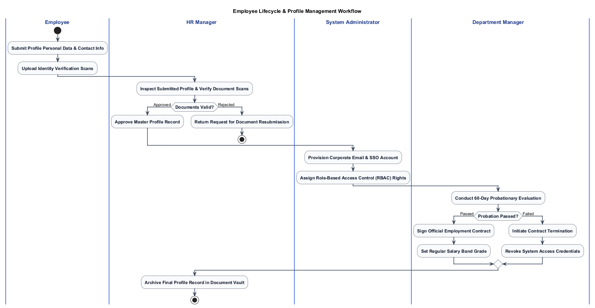

---

### Workforce Tracking

**Description:** Workforce telemetry workflow covering Workstation Agent Logging, Idle Time Detection, GPS Geofenced Clock-in, Field Service Dispatch, and E-Sign Audit.

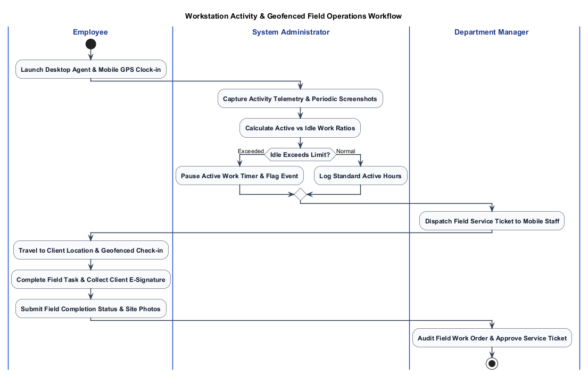

---

### Recruitment

**Description:** Talent acquisition workflow covering Job Requisition Approval, Automated CV Parsing, Technical Interview Scorecards, Digital Offer Letters, and Pre-Hire Setup.

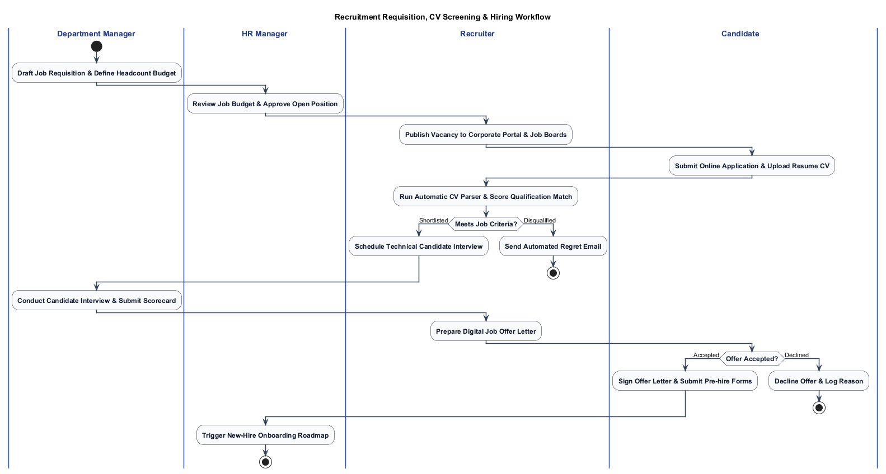

---

### Time & Attendance

**Description:** Time management workflow covering Daily Clock-in/out, Overtime & Leave Requests, Manager Approvals, and Monthly Timesheet Verification.

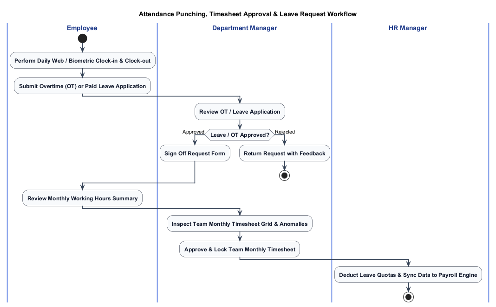

---

### Payroll & Benefits

**Description:** Payroll administration workflow covering Timesheet Import, Gross-to-Net Computation, Tax/BHXH Deductions, HR Audit, and Direct Bank Deposit Batch File Generation.

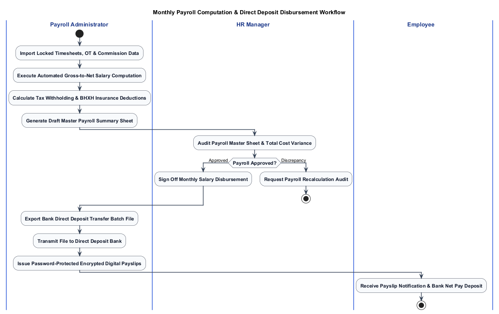

---

### Performance

**Description:** Strategic talent appraisal workflow covering Corporate OKR Cascade, 360-Degree Feedback & Self-Appraisal, Manager 1-on-1 Coaching, Executive Calibration, and Bonus Distribution.

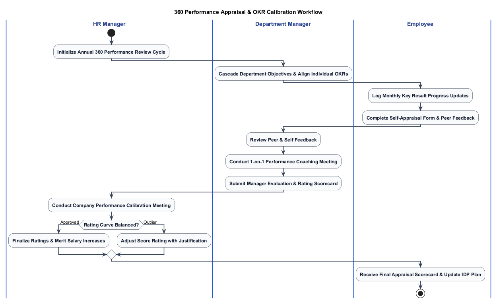

---

### Platform

**Description:** Platform security workflow covering User Login Request, SSO Identity Verification, Multi-Factor Authentication (MFA), and Fine-Grained Role Permission Enforcement.

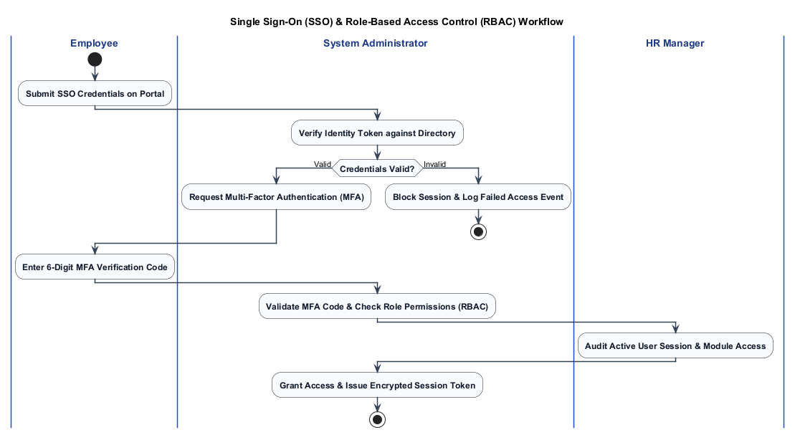

---

### Compliance

**Description:** Compliance management workflow covering Policy Definition, Mandatory Staff Sign-off, PII Data Masking, Real-time Security Event Detection, and Audit Trail Reporting.

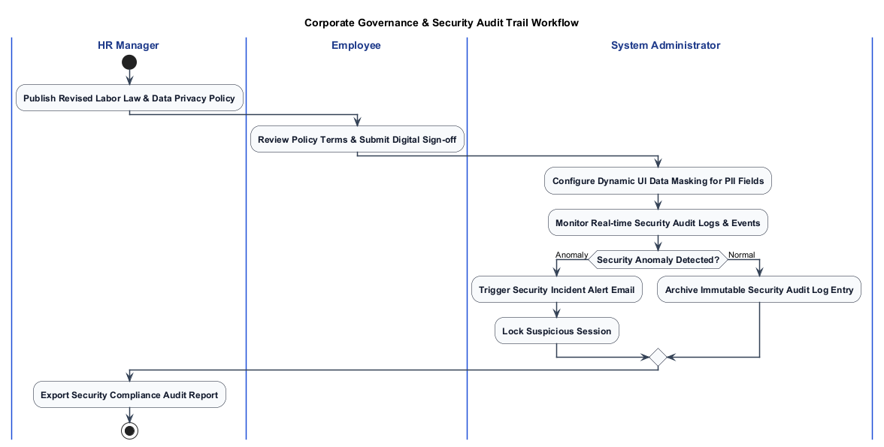

---

### Analytics

**Description:** Analytics workflow covering Drag-and-Drop Filter Selection, Database Aggregation, Dynamic Chart Rendering, Executive Metric Auditing, and Automated PDF/Excel Delivery.

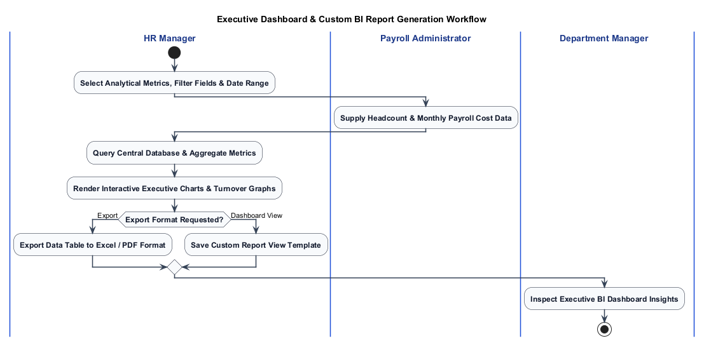

---

### Projects

**Description:** Project management workflow covering Project Creation, Member Capacity Allocation, Billable Timesheet Logging, Labor Cost Analysis, and Client Invoicing.

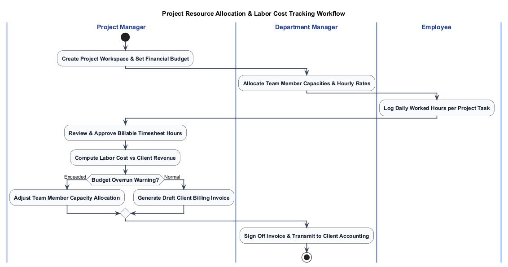

---

## 60 Detailed Use Case Diagrams (UC01 - UC60)

# Module: Core HR & Employee Management

### UC01: Register New Employee Profile
**Description:** Register a new employee profile with personal particulars, job classification, and emergency contacts.

---

### UC02: Maintain Employee Personal Directory
**Description:** Access and review personal employee profile information, academic records, and employment history.

---

### UC03: Request Profile Data Update
**Description:** Submit updates for residential address, contact number, bank account details, and dependent info.

---

### UC04: Upload Personnel Contract Document
**Description:** Upload employment contracts, degree certificates, and tax registration documents to document vault.

---

### UC05: Access Confidential Document Vault
**Description:** Inspect, verify, and retrieve archived employment agreements and legal records.

---

### UC06: Configure Organizational Department Structure
**Description:** Establish new business units, department branches, and parent-child organizational trees.

---

### UC07: Define Job Positions & Salary Bands
**Description:** Define job titles, seniority levels, responsibilities, and associated pay grade ranges.

---

### UC08: Visualize Company Organization Chart
**Description:** Render interactive graphical organizational chart showing manager reporting lines and team structure.

---

### UC09: Publish Internal Communication Announcement
**Description:** Broadcast corporate announcements, policy revisions, and news notifications across company portal.

---

### UC10: Search Corporate Staff Directory
**Description:** Search colleague contact details, job roles, office extensions, and work locations.

---

# Module: Workforce Activity & Location Audit

### UC11: Initialize Workstation Activity Tracking
**Description:** Start background workstation timer to measure active working hours and task effort.

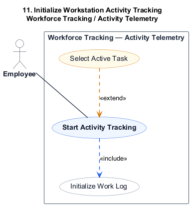

---

### UC12: Audit Staff Productivity Metrics
**Description:** Analyze team daily productivity scores, active keyboard/mouse ratios, and idle time summaries.

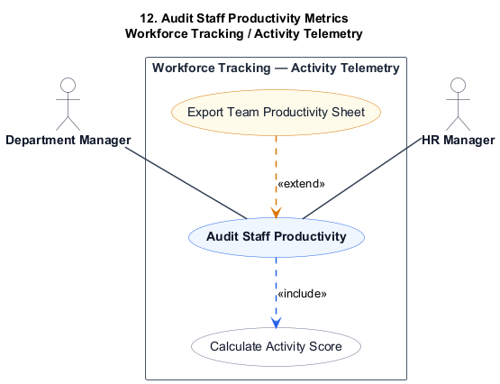

---

### UC13: Monitor Software Application & Web Usage
**Description:** Track software tools, web browser URLs, and active desktop windows used during working hours.

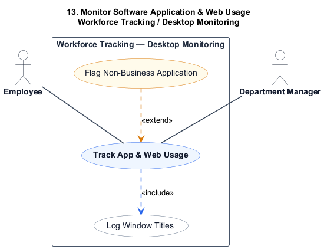

---

### UC14: Inspect Workstation Desktop Screenshots
**Description:** Inspect automated periodic desktop screenshots captured during active working sessions.

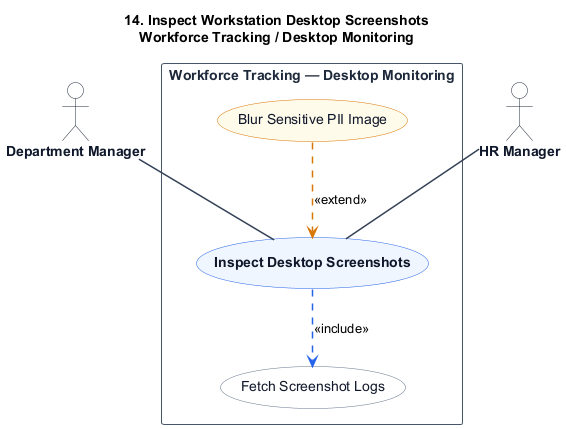

---

### UC15: Activate GPS Geofenced Location Tracking
**Description:** Enable mobile GPS location breadcrumbs during field client visits and travel assignments.

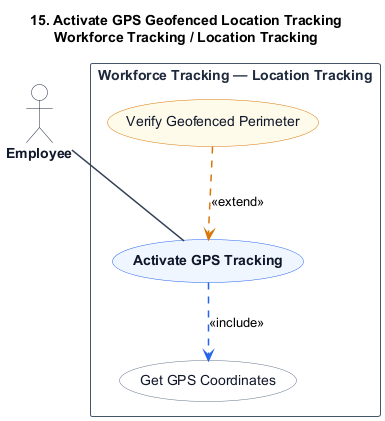

---

### UC16: Monitor Field Staff Live Location Map
**Description:** View live map displaying current GPS positions and travel routes of field personnel.

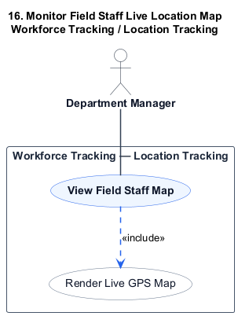

---

### UC17: Dispatch Field Operations Work Order
**Description:** Dispatch client visit tasks, service job orders, and schedule assignments to field personnel.

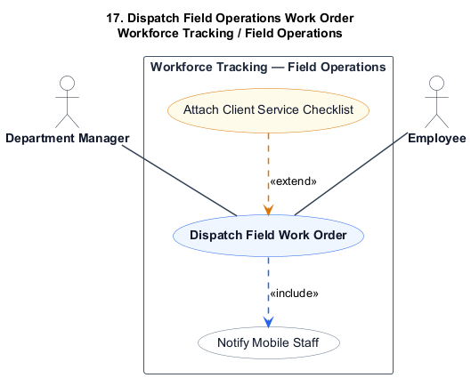

---

### UC18: Submit Field Completion Report
**Description:** Submit field service completion report, client e-signatures, and site status photographs.

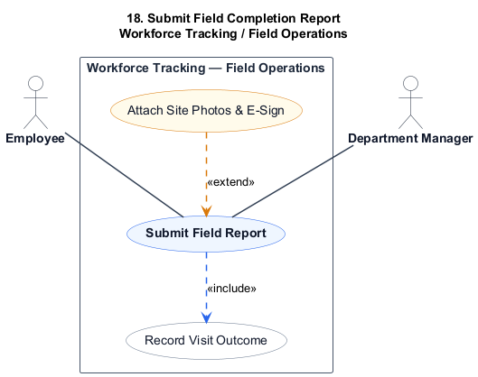

---

# Module: Recruitment & Talent Acquisition ATS

### UC19: Submit Job Opening Requisition
**Description:** Draft job requisition requesting open headcount budget approval from department management.

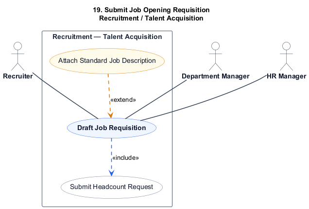

---

### UC20: Publish Job Posting to Career Portal
**Description:** Post approved job vacancy on corporate career site and external employment portals.

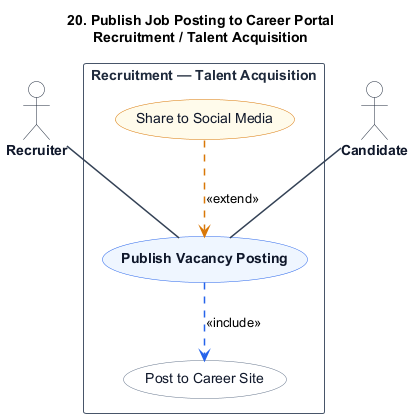

---

### UC21: Screen & Score Candidate Applications
**Description:** Parse candidate CV resumes, score qualification criteria, and shortlist top applicants.

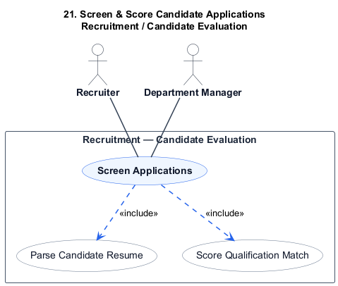

---

### UC22: Generate Candidate Job Offer Letter
**Description:** Prepare formal job offer agreement including compensation details, starting date, and conditions.

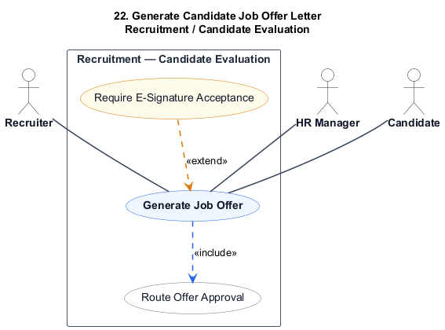

---

### UC23: Send Automated Candidate Email
**Description:** Send interview scheduling invitations, application status updates, or regret letters.

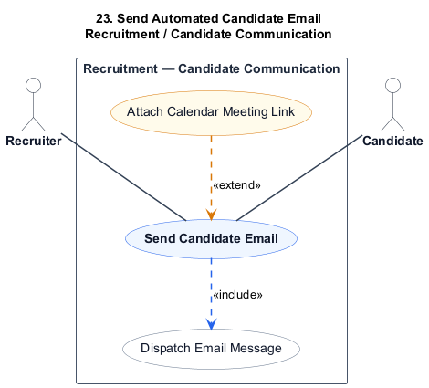

---

### UC24: Log Candidate Communication History
**Description:** Record telephone screening notes, email correspondence, and feedback logs in ATS profile.

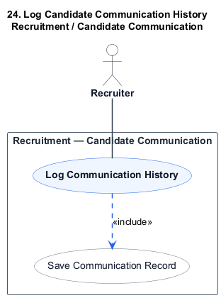

---

### UC25: Draft New-Hire Onboarding Roadmap
**Description:** Prepare orientation task schedule, compliance checklist, and assign buddy mentor for new hire.

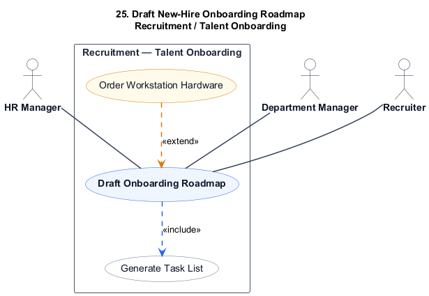

---

### UC26: Complete New-Hire Onboarding Tasks
**Description:** Complete mandatory orientation modules, nộp pre-hire legal forms, and verify account setup.

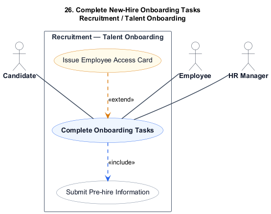

---

# Module: Time, Attendance & Leave Management

### UC27: Record Daily Attendance Clock-in
**Description:** Log morning arrival work timestamp via web portal, biometrics, or mobile app.

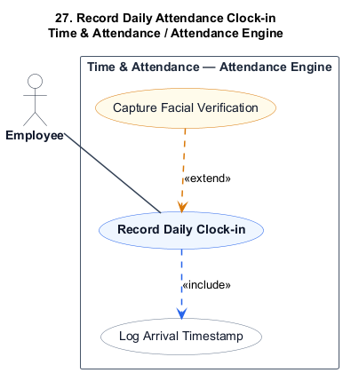

---

### UC28: Record Daily Attendance Clock-out
**Description:** Log end-of-day departure timestamp and calculate total daily active working duration.

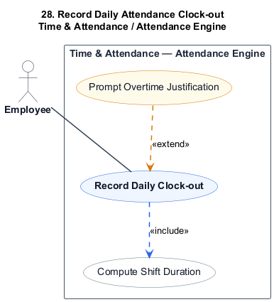

---

### UC29: Review Personal Attendance History
**Description:** Access monthly attendance calendar logs, check lateness flags, and review work hours.

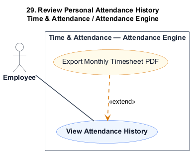

---

### UC30: Submit Weekly Work Timesheet
**Description:** Fill out weekly work timesheet allocating project task hours and submit for manager approval.

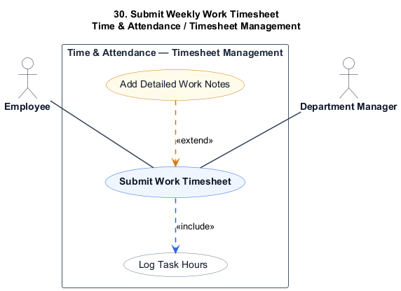

---

### UC31: Approve Department Weekly Timesheets
**Description:** Review team members' weekly timesheets, resolve anomalies, and lock data for payroll.

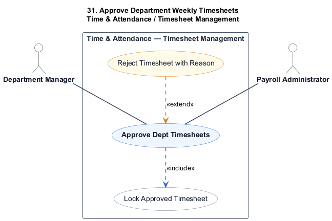

---

### UC32: Configure Department Shift Rosters
**Description:** Define shift working hours, break schedules, rotational shifts, and overtime thresholds.

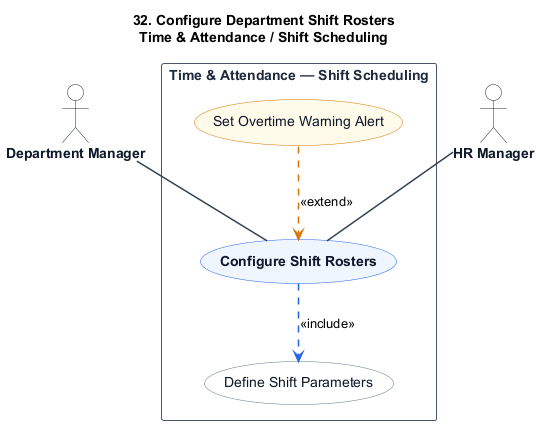

---

### UC33: Assign Work Shift Schedule
**Description:** Assign weekly work shifts to staff members and publish team roster schedule.

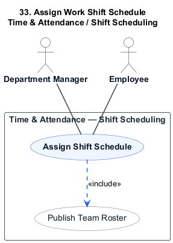

---

### UC34: Submit Paid Leave Application
**Description:** Apply for annual leave, sick leave, or maternity leave and route for manager review.

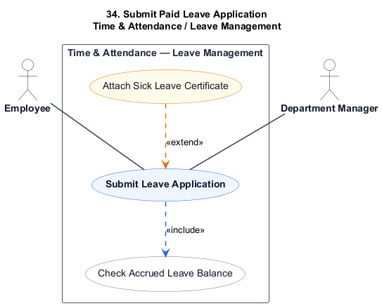

---

### UC35: Approve Employee Leave Application
**Description:** Review employee leave requests, check department shift coverage, and sign off time-off.

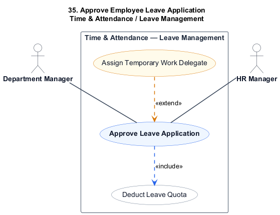

---

### UC36: Track Leave Quotas & Accruals
**Description:** View real-time paid leave balance, accrued sick days, and historical time-off usage.

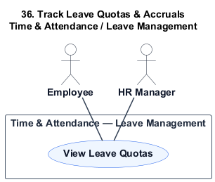

---

# Module: Payroll Processing & Benefits Admin

### UC37: Execute Monthly Payroll Computation
**Description:** Run automated gross-to-net salary calculations including tax withholding, BHXH insurance, and allowances.

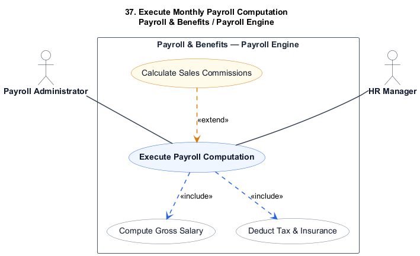

---

### UC38: Approve Monthly Payroll Disbursement
**Description:** Audit monthly master payroll summary sheet and authorize bank transfer disbursement.

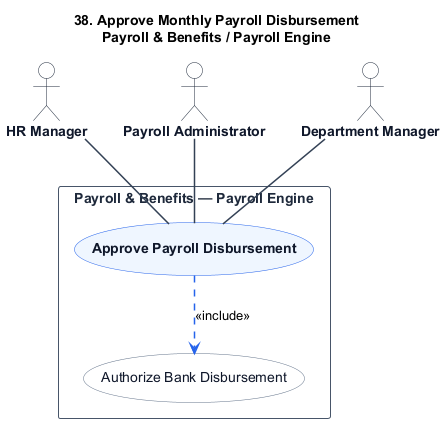

---

### UC39: Distribute Digital Confidential Payslips
**Description:** Generate password-protected encrypted PDF payslips and email them securely to staff.

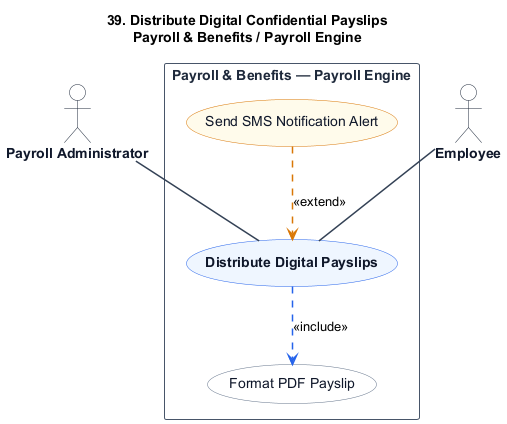

---

### UC40: Configure Corporate Benefit Plans
**Description:** Configure employee healthcare insurance, wellness programs, and flexible benefit rules.

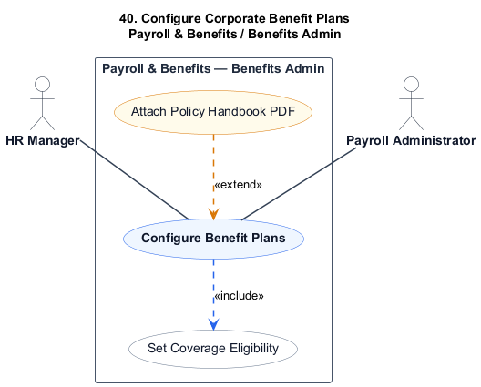

---

### UC41: Enroll in Flexible Benefit Scheme
**Description:** Enroll in annual corporate health insurance and select flexible benefit options.

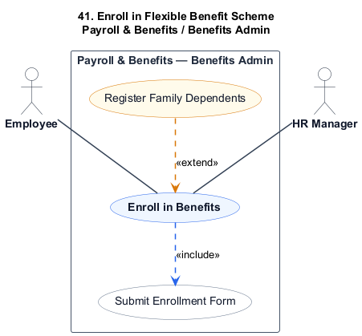

---

### UC42: Define Organizational Salary Architecture
**Description:** Establish base salary grade bands, allowance structures, and overtime pay formulas.

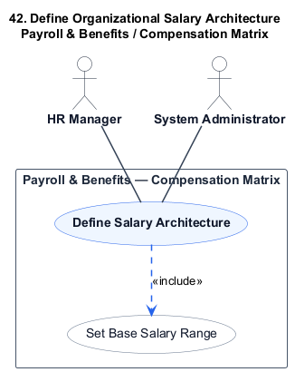

---

### UC43: Create Annual Compensation Increase Scheme
**Description:** Create annual merit salary revision budgets and performance bonus allocation matrices.

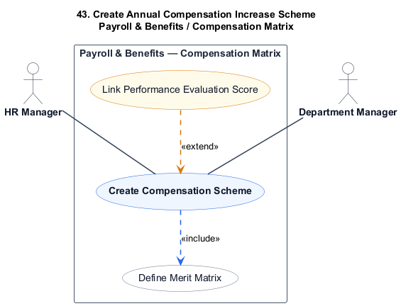

---

### UC44: Approve Employee Salary Adjustment
**Description:** Review individual promotion proposals or merit salary adjustments for approval.

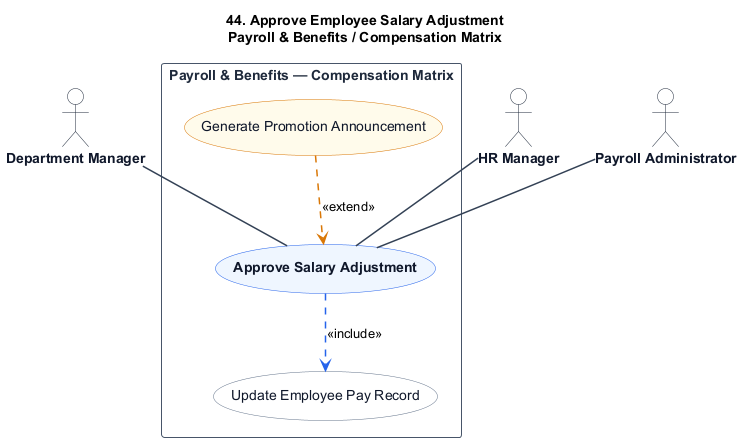

---

# Module: Performance, OKRs & Talent Growth

### UC45: Initiate 360 Performance Review Cycle
**Description:** Launch company-wide 360-degree performance evaluation cycles involving self and manager forms.

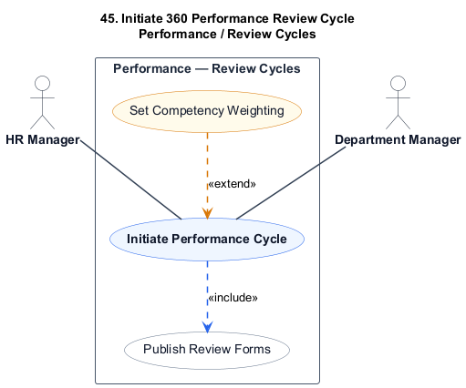

---

### UC46: Submit Employee Self-Appraisal Form
**Description:** Complete self-appraisal form rating key competencies, accomplishments, and goals.

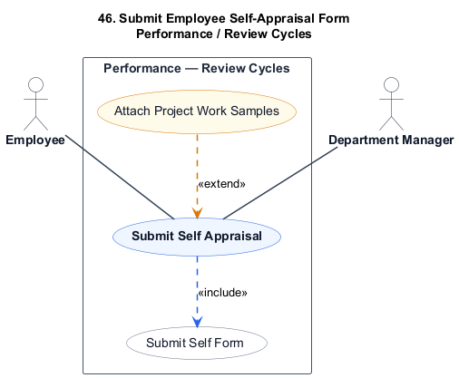

---

### UC47: Submit Manager Performance Scorecard
**Description:** Evaluate subordinate employee performance, score core competencies, and assign final rating.

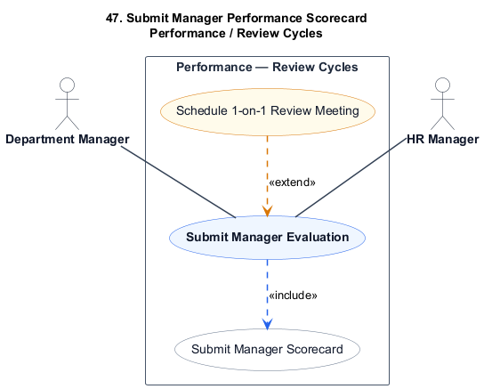

---

### UC48: Establish Strategic Goals & OKRs
**Description:** Set individual SMART goals and key results aligned with department objectives.

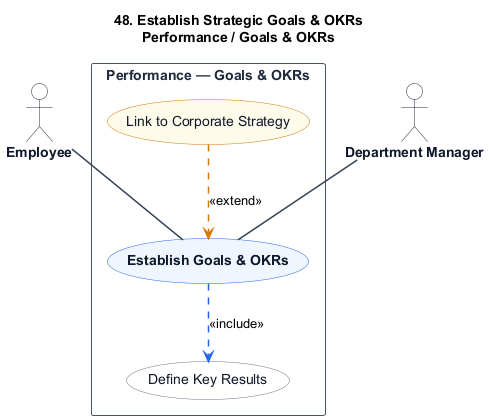

---

### UC49: Update Key Result Progress Status
**Description:** Update OKR key result completion percentages and log milestone progress notes.

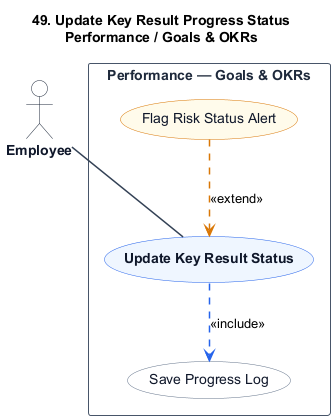

---

### UC50: Review & Verify Goal Accomplishments
**Description:** Audit employee OKR deliverables, verify key result metrics, and sign off goal status.

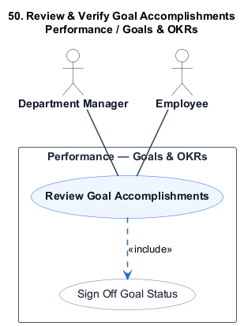

---

### UC51: Schedule 1-on-1 Coaching Session
**Description:** Schedule regular 1-on-1 performance coaching and career development meetings.

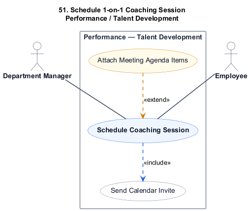

---

### UC52: Draft Individual Development Plan (IDP)
**Description:** Formulate personal career growth plan, skill improvement milestones, and training targets.

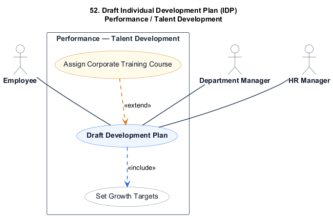

---

### UC53: Send Peer Recognition Kudos Badge
**Description:** Send public appreciation badges and kudos points to colleagues on corporate feed.

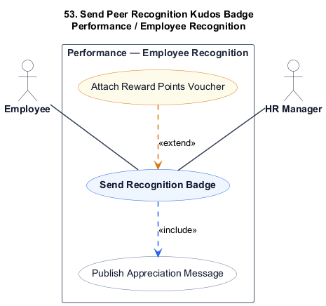

---

### UC54: Monitor Company Performance Analytics
**Description:** View company-wide rating distribution curves, bell curve calibration, and talent matrix graphs.

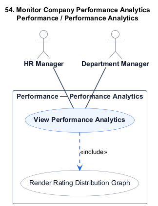

---

# Module: Platform Infrastructure & Access Control

### UC55: Authenticate System User Session
**Description:** Authenticate user credentials via Single Sign-On (SSO) and initialize secure active session.

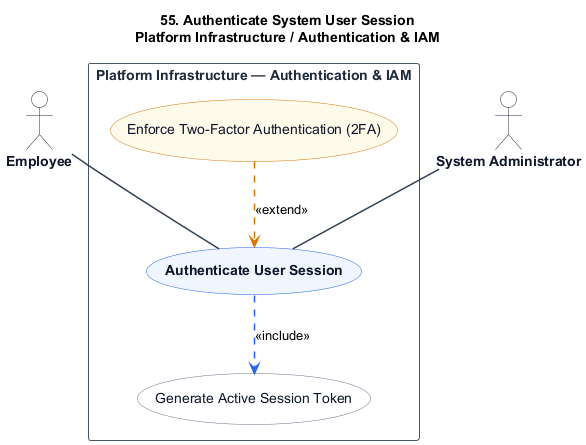

---

### UC56: Configure Role-Based Access Control (RBAC)
**Description:** Define user roles, module permissions, and fine-grained data visibility boundaries.

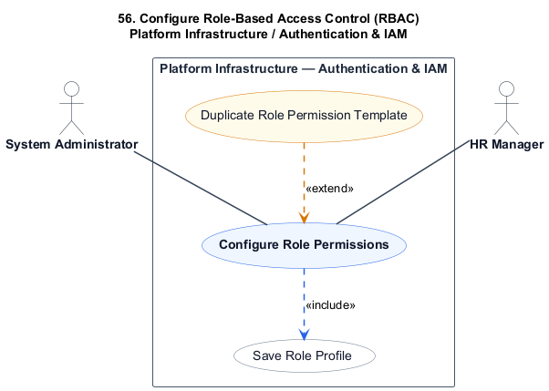

---

# Module: Corporate Governance & Security Audit

### UC57: Establish Regulatory Compliance Policy
**Description:** Configure labor compliance rules, GDPR data retention limits, and corporate governance policies.

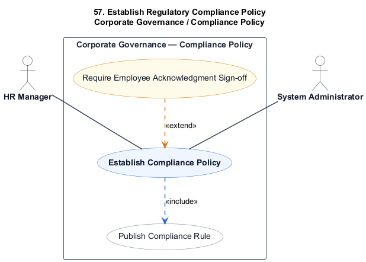

---

### UC58: Audit System Security Logs
**Description:** Inspect real-time system audit trails, access permission logs, and security anomaly events.

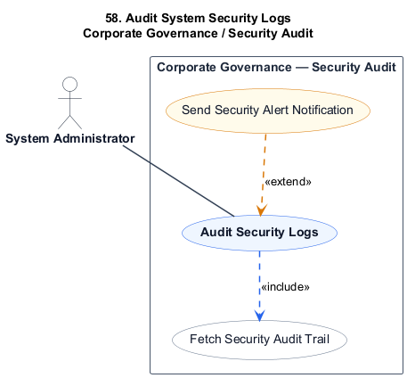

---

# Module: HR Analytics & BI Reporting

### UC59: Build & Export Custom HR Reports
**Description:** Design custom tabular reports, apply data filters, and export to Excel/CSV files.

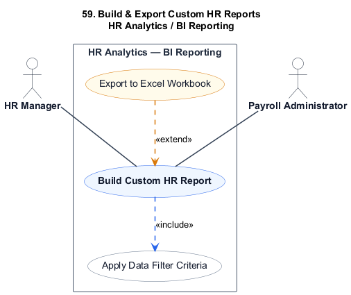

---

# Module: Project Resource & Cost Control

### UC60: Manage Project Allocations & Cost Tracking
**Description:** Create project workspace, assign team member capacities, and monitor project labor budget.

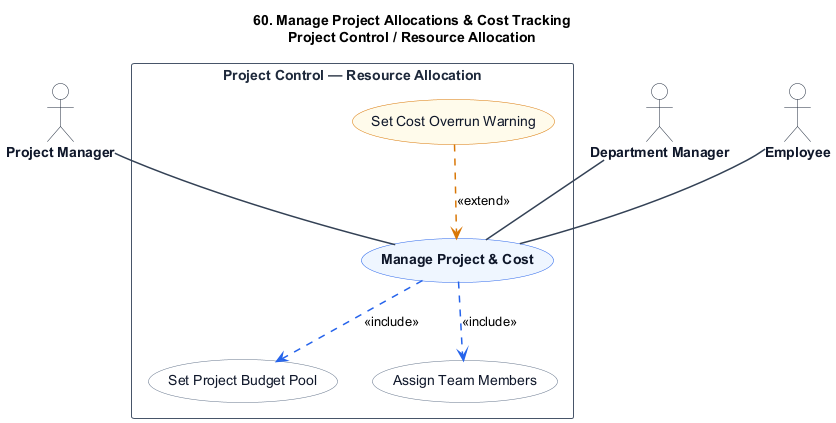

---
