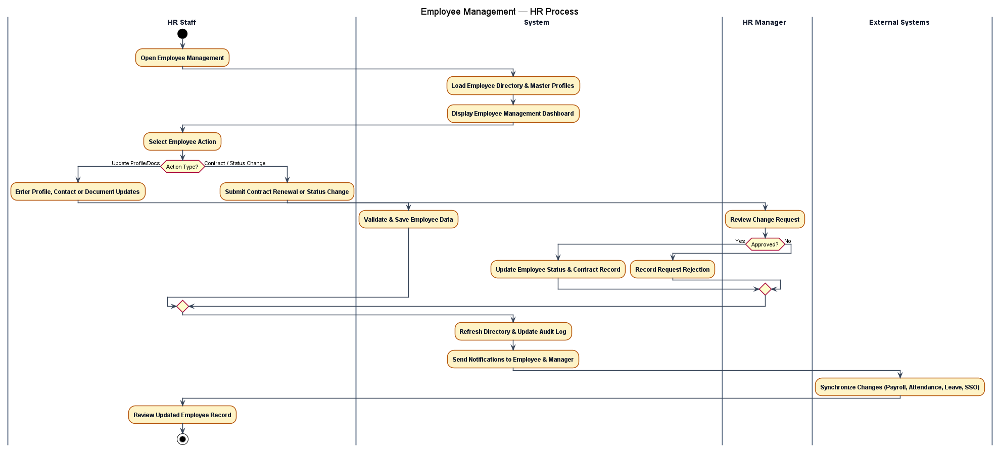
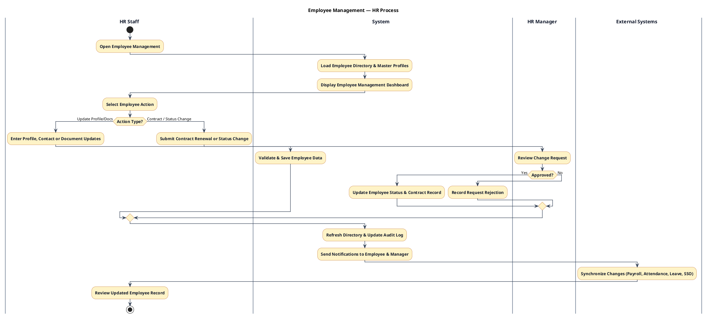

## Employee Management – UML Process



## Các chức năng chính

```text
Employees
├── Employee Directory
│   ├── All Employees
│   ├── Active Employees
│   ├── On Leave
│   ├── Inactive Employees
│   └── Employee Profile
│       ├── Overview
│       ├── Personal Information
│       ├── Contact & Address
│       ├── Job Information
│       ├── Reporting Line
│       ├── Employment History
│       ├── Contracts
│       ├── Documents
│       ├── Leave Summary
│       └── Change History
│
├── Contracts
│   ├── Current Contracts
│   ├── Expiring Contracts
│   ├── Contract Renewal
│   └── Contract History
│
├── Documents
│   ├── All Documents
│   ├── Missing Documents
│   └── Expiring Documents
│
└── Employee Status
    ├── Current Status
    └── Status History
```

### Employee Directory

Quản lý danh sách toàn bộ nhân sự công ty và trạng thái làm việc:

- **All Employees**: Hiển thị toàn bộ danh mục nhân sự.
- **Active Employees**: Nhân viên đang làm việc chính thức & thử việc.
- **On Leave**: Nhân viên đang trong kỳ nghỉ phép dài hạn hoặc thai sản.
- **Inactive Employees**: Nhân viên đã tạm hoãn hợp đồng hoặc nghỉ việc.

### Employee Profile

Hồ sơ chi tiết 360 độ của từng nhân viên bao gồm:

- **Overview**: Tóm tắt thông tin nhân sự, ảnh đại diện, vị trí, phòng ban & mã nhân viên.
- **Personal Information**: Họ tên, ngày sinh, giới tính, số CCCD/CMND, quốc tịch, tình trạng hôn nhân.
- **Contact & Address**: Email công ty/cá nhân, số điện thoại, địa chỉ thường trú & tạm trú, liên hệ khẩn cấp.
- **Job Information**: Chức danh, cấp bậc (level), phòng ban/team trực thuộc, địa điểm làm việc, ngày gia nhập.
- **Reporting Line**: Quản lý trực tiếp (Direct Manager), danh sách nhân viên cấp dưới (Direct Reports) và vị trí trong Org Chart.
- **Employment History**: Lịch sử thăng tiến, chuyển phòng ban, điều chuyển công tác & thay đổi mức lương.
- **Contracts**: Danh sách hợp đồng lao động đã ký và phụ lục hợp đồng.
- **Documents**: Kho tài liệu cá nhân (CCCD, bằng cấp, chứng chỉ, quyết định tuyển dụng).
- **Leave Summary**: Tổng hợp quỹ phép năm, số ngày phép đã sử dụng và phép còn lại.
- **Change History**: Nhật ký ghi lại toàn bộ các lần chỉnh sửa thông tin hồ sơ nhân viên.

### Contracts

Quản lý hợp đồng lao động và phụ lục hợp đồng:

- **Current Contracts**: Hợp đồng đang có hiệu lực.
- **Expiring Contracts**: Cảnh báo hợp đồng sắp hết hạn trong 30/60 ngày.
- **Contract Renewal**: Quy trình gia hạn hợp đồng mới hoặc chuyển sang hợp đồng không xác định thời hạn.
- **Contract History**: Lưu trữ toàn bộ hợp đồng cũ và lịch sử ký duyệt.

### Documents

Quản lý hồ sơ, tài liệu pháp lý nhân sự:

- **All Documents**: Toàn bộ tệp tài liệu đã lưu trữ trong hệ thống.
- **Missing Documents**: Cảnh báo hồ sơ còn thiếu (chưa nộp CCCD, bằng cấp, ảnh thẻ).
- **Expiring Documents**: Cảnh báo tài liệu sắp hết hạn (Visa, Giấy phép lao động, Chứng chỉ hành nghề).

### Employee Status

Quản lý trạng thái công tác của nhân sự:

- **Current Status**: Trạng thái hiện tại (Active, Probation, On Leave, Suspended, Terminated).
- **Status History**: Lịch sử chuyển đổi trạng thái làm việc và lý do thay đổi.

---

## Nguồn dữ liệu

### Input Data

Dữ liệu nhân viên được tiếp nhận từ:

```text
Recruitment ATS / Onboarding Management
        ↓
Employee Directory & Profile
        ↓
Contracts & Status Management
```

### Employee Assignment Data

Dữ liệu liên kết nhân viên với cơ cấu tổ chức và quản lý:

```text
Employee Profile
├── Department & Team
├── Job Title & Position
├── Direct Manager (Reporting Line)
├── Active Contract Details
└── Work Location
```

---

## Dataflow

### Luồng cập nhật Hồ sơ & Trạng thái Nhân viên

```text
HR Staff chọn hành động (Profile / Contract / Document / Status)
        ↓
Hệ thống kiểm tra định dạng & ràng buộc dữ liệu
        ↓
HR Manager phê duyệt (đối với Hợp đồng & Chuyển trạng thái)
        ↓
Hệ thống lưu dữ liệu & cập nhật Employee Directory
        ↓
Ghi nhận Lịch sử thay đổi (Change History) & Audit Log
        ↓
Gửi thông báo tới Nhân viên & Quản lý trực tiếp
        ↓
Đồng bộ dữ liệu sang các Phân hệ liên quan (Payroll, Attendance, Leave, SSO/AD)
```

---

## Tích hợp bên ngoài

Dữ liệu nhân viên đồng bộ tự động tới các hệ thống:

- **Identity / Active Directory / SSO**: Cấp/khóa tài khoản người dùng và phân quyền truy cập.
- **Payroll Engine**: Cập nhật thông tin tài khoản ngân hàng, mã số thuế & mức lương tính BHXH.
- **Time & Attendance**: Đồng bộ danh sách nhân viên vào máy chấm công & lịch làm việc.
- **Leave Management**: Xác định Quản lý trực tiếp ký duyệt đơn xin nghỉ phép.
- **Offboarding**: Thu hồi tài sản, đóng tài khoản và lưu hồ sơ lưu trữ.

---

## Các dữ liệu cốt lõi

```text
EmployeeMaster
PersonalDetail
ContactAddress
EmploymentRecord
ReportingRelationship
LaborContract
DocumentArchive
StatusHistory
AuditTrail
```

---

## Nguyên tắc thiết kế

- **Single Source of Truth**: Hồ sơ nhân viên là nguồn dữ liệu gốc cho toàn bộ hệ thống HR.
- **Data Privacy & GDPR**: Phân quyền truy cập nghiêm ngặt và che mờ thông tin cá nhân nhạy cảm (PII).
- **Auditability**: Mọi thay đổi về lương, hợp đồng và trạng thái phải có Audit Log không thể xóa sửa.
- **Proactive Alerts**: Cảnh báo tự động đối với hợp đồng & giấy phép sắp hết hạn.
- **Integration Readiness**: Xuất sự kiện (Event Driven) để đồng bộ thời gian thực sang Payroll, Timekeeping và SSO.

---

## PlantUML Swimlane Activity Diagram Code


