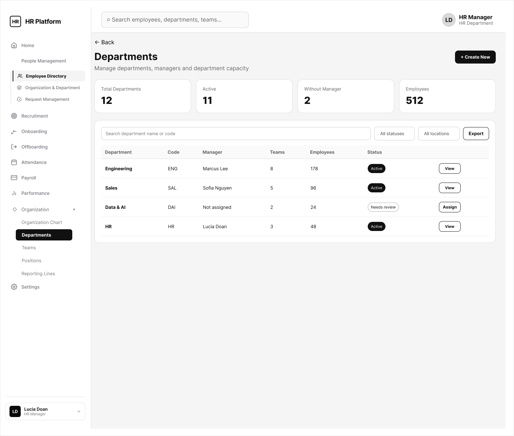
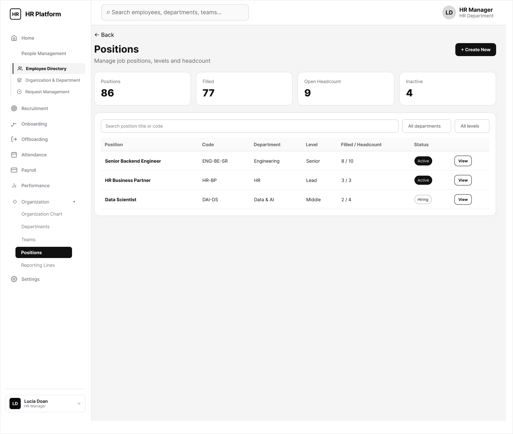
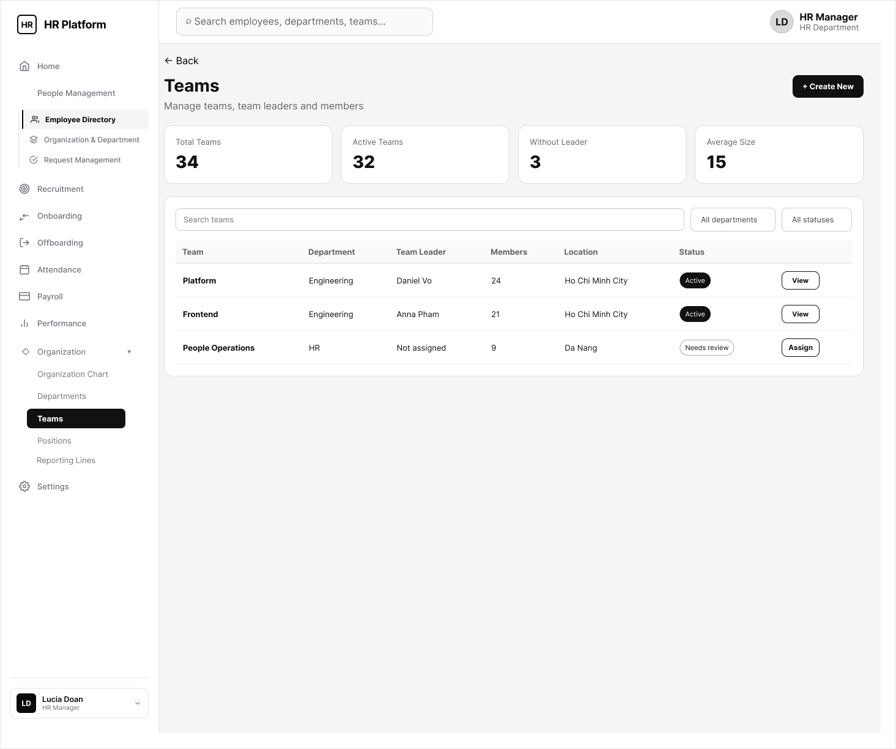

# HR Platform — UI/UX Design & Screen Documentation

This document provides complete, high-fidelity documentation for the **HR Platform Enterprise Edition** user interface screens, user experience flows, interactive modals, and organizational management views. All documentation corresponds directly to the visual design assets located in the `ui&ux/docs` directory.

---

## 📑 Table of Contents

1. [Authentication & Security Screens](#1-authentication--security-screens)
2. [Executive Dashboard & Analytics](#2-executive-dashboard--analytics)
3. [Employee Directory & Categorization Tabs](#3-employee-directory--categorization-tabs)
4. [Master 360 Employee Profile Views](#4-master-360-employee-profile-views)
5. [Organizational Hierarchy & Unit Management](#5-organizational-hierarchy--unit-management)
6. [Interactive Modals, Popups & Action Forms](#6-interactive-modals-popups--action-forms)
7. [Management Forms & Data Import/Export](#7-management-forms--data-importexport)

---

## 🔒 1. Authentication & Security Screens

### 1.1 Login Screen (Workforce HR)

- **Description:** Enterprise authentication portal supporting credential login (Corporate Email/Password) and Single Sign-On (Google / Microsoft Azure AD SSO).
- **UI Components:** Email/Password input fields, "Remember Me" checkbox, "Forgot Password" link, SSO provider buttons, and security disclaimer.

### 1.2 Forgot Password Request Screen

- **Description:** Self-service password recovery interface allowing users to request an OTP code or reset link sent to their verified email address.
- **UI Components:** Email input, "Send Reset Code" action button, and "Back to Login" navigation link.

### 1.3 Reset Password Screen

- **Description:** Secure interface for entering and validating new password credentials after successful OTP verification.
- **UI Components:** New Password input, Confirm Password input, dynamic Password Strength Indicator meter, and real-time validation rules.

---

## 📊 2. Executive Dashboard & Analytics

### 2.1 HR Executive Dashboard (Monochrome Edition)

- **Description:** High-level executive dashboard designed for C-Level Officers and HR Managers, presenting real-time workforce Key Performance Indicators (KPIs).
- **UI Components:**
  - KPI Stat Cards: Headcount (`1,248`), Monthly Turnover Rate (`1.2%`), Estimated Monthly Payroll (`$340,000`), and Active Hiring Requisitions.
  - 12-Month Headcount Trend Line Chart.
  - Event Widgets: Upcoming Birthdays and Work Anniversary Announcements.

### 2.2 People Management Overview

- **Description:** Central command overview for the People Management module, offering instant access to department metrics and staff rosters.
- **UI Components:** Global search input, department filter dropdowns, "+ Add New Employee" primary action button, and summary breakdown cards.

---

## 👥 3. Employee Directory & Categorization Tabs

### 3.1 Master Staff Directory (Directory Tab)

- **Description:** Master employee directory table listing all company personnel with multi-column sorting, filtering, and pagination.
- **UI Components:** Employee Avatar, Full Name, Employee ID (`EMP-xxx`), Department, Job Title, Employment Status Badge, and Quick Action Menu.

### 3.2 Labor Contracts Management (Contracts Tab)

- **Description:** Contracts audit view tracking active employment contracts, expiration alerts (30/60 days), and renewal history.
- **UI Components:** Contract Type (Indefinite / Definite Term), Start Date, Expiration Date, Expiration Warning Badge, and "Renew Contract" action button.

### 3.3 Employee Movement & Promotion History (History Tab)

- **Description:** Audit trail logging all internal transfers, promotions, title changes, and salary grade adjustments across the organization.
- **UI Components:** Chronological movement timeline, Previous Position, New Assigned Position, Approving Manager, Effective Date, and Movement Type.

### 3.4 Employment Status Roster (Status Tab)

- **Description:** Real-time roster tracking employee working states (Full-Time Active, Probationary, On Paid Leave, Suspended, or Terminated).
- **UI Components:** Color-coded status badges (`Active` - Green, `Probation` - Blue, `On Leave` - Amber), effective date, and status change justification.

---

## 👤 4. Master 360 Employee Profile Views

### 4.1 Master Profile Overview (Updated Overview)

- **Description:** Comprehensive 360-degree profile landing page providing an intuitive summary of an employee's personal and professional attributes.
- **UI Components:** Profile Banner, Avatar Image, Full Name, Job Title, Employee ID, Primary Contact Info, Direct Manager Card, and Quick Action Action Bar.

### 4.2 Employment & Job Details Tab

- **Description:** Detailed view covering organizational assignments, contract specifics, reporting hierarchy, tax IDs, and direct deposit bank accounts.
- **UI Components:** Job Grade Level, Department, Direct Supervisor, Tax Registration Number, Social Insurance Code, and Bank Account Details.

### 4.3 Education, Qualifications & Certifications Tab
.png)
- **Description:** Repository storing academic degrees, professional certifications (e.g., PMP, SHRM), language skills, and scanned diploma attachments.
- **UI Components:** Institution Name, Degree Achieved, Graduation Year, Certification ID, Expiration Date, and Download Attachment action link.

### 4.4 Personal Document Vault (Documents Tab)

- **Description:** Secure document vault storing sensitive legal paperwork including National ID scans, passports, work permits, and signed contracts.
- **UI Components:** Document Type Tag, File Format (PDF/Image), Upload Date, Verification Status Badge, and Secure File Preview button.

### 4.5 Profile Change Audit History Tabs

- **Description:** Version-controlled audit log recording every historical edit made to the employee profile for compliance and data integrity.

---

## 🏛️ 5. Organizational Hierarchy & Unit Management

### 5.1 Interactive Organization Chart (Org Chart)

- **Description:** Interactive visual hierarchy map displaying corporate structure, department trees, and reporting chains from Executives to Staff.
- **UI Components:** Expandable/collapsible org nodes, department head indicators, headcount counters per node, and zoom/pan controls.

### 5.2 Department Directory & Detail Views

- **Description:** Management interfaces for searching company departments and viewing department members, total budget, and department leads.

### 5.3 Job Positions Directory & Detail Views

- **Description:** Job architecture catalog listing all standardized job titles, salary bands, seniority levels, and vacant positions.

### 5.4 Teams Directory & Reporting Lines

- **Description:** Interfaces for managing agile project teams, assigning team leaders, and mapping direct/matrix reporting relationships.

---

## 💬 6. Interactive Modals, Popups & Action Forms

### 6.1 New Employee Onboarding Modal (Add Employee Modal)

- **Description:** Multi-step modal wizard for entering new hire personal details, contact information, and initial onboarding data.

### 6.2 Employment Assignment Popup

- **Description:** Action popup for configuring an employee's department, team assignment, job position, and supervisor line.

### 6.3 Compensation & Role Access Popup

- **Description:** Security popup for assigning base compensation, allowances, and setting system access permissions (RBAC User Roles).

### 6.4 Labor Contract Creation Modal

- **Description:** Modal form for drafting new labor agreements, setting contract terms, and uploading signed PDF contracts.

### 6.5 Manager & Member Assignment Popups

- **Description:** Searchable modal dialogs for assigning department heads, team leads, or attaching staff members to specific units.

---

## 📝 7. Management Forms & Data Import/Export

### 7.1 Entity Creation & Editing Forms

- **Description:** Specialized configuration forms for creating or updating Department, Position, and Team metadata.

### 7.2 Data Export & Reporting Interface

- **Description:** Advanced data extraction interface allowing HR administrators to export employee datasets to Excel (.xlsx) or CSV formats based on custom column filters.
